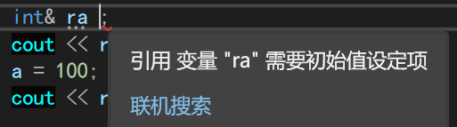
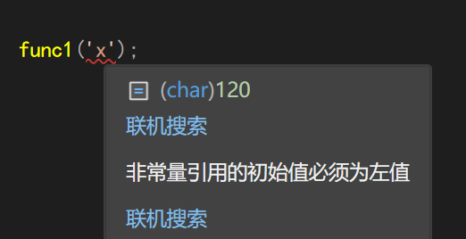

# Chapter13 引用


##  13.1 引用的介绍

- 引用变量是C++新增的复合类型。

- 引用是已定义的变量的别名。

- 引用的主要用途是用作函数的形参和返回值。

- 声明/创建引用的语法：**数据类型 &引用名=原变量名;**

**注意事项**:

- 引用的数据类型要与原变量名的数据类型相同。
-  引用名和原变量名可以互换，**它们值和内存单元是相同的**。
-  **必须**在声明引用的时候初始化，**初始化后不可改变**。
-  C和C++用&符号来指示/取变量的地址，C++给&符号赋予了另一种含义。




## 13.2 引用的本质

引用是指针常量`(void *const ptr)`的伪装。引用是编译器提供的一个有用且安全的工具，去除了指针的一些缺点，禁止了部分不安全的操作。

变量是什么？变量就是一个在程序执行过程中可以改变的量。换一个角度，变量是一块内存区域的名字，它代表了这块内存区域，当我们对变量进行修改的时候，会引起内存区域中内容的改变。

在计算机看来，内存区域根本就不存在什么名字，它仅有的标志就是它的地址，因此我们若想修改一块内存区域的内容，只有知道他的地址才能实现。

所谓的变量只不过是编译器给我们进行的一种抽象，让我们不必去了解更多的细节，降低我们的思维跨度而已。

程序员拥有引用，但编译器仅拥有指针（地址）。

引用的底层机制实际上是和指针一样的。不要相信有别名，不要认为引用可以节省一个指针的空间，因为这一切不会发生，编译器还是会把引用解释为指针。

 **引用和指针本质上没有区别。**


### 13.3 引用作函数参数传递

- 将引用作为函数的形参, 在函数内部就是**实参的别名**

- 这种方法也叫按引用传递或传引用。（传值、传地址、传引用只是说法不同，其实都是传值。）引用的本质是指针，传递的是变量的地址，在函数中，修改形参会影响实参。

  

示例: 设计一个函数为一个指针动态开辟内存空间

```c++
void func1(int ** p)
{
    *p = new int(3);
}
void func2(int* &p)
{
     p = new int(3);
}

int main()
{
    int *p =nullptr;
    func1(&p);
    //func2(p);
}
```

解释:

- 为什么func1 要传入二级指针? 首先是因为需要对一级指针p进行修改(分配内存空间),因此需要将**指针的地址传入** ,变量类型也就是二级指针

- 解引用的出现让参数不必为二级指针 ,且使得定义的函数可读性更佳 , 更易写


## 13.4  引用的形参和const

思考一种情况: 可不可将一个常量按引用传递?

```c++
//现在定义func1
void func1(int & a)
{
 cout<<a <<'\n';
}
```

如果直接传递常量,报错:必须传入可修改的左值



那么该如何处理 在函数声明的变量前加入const修饰即可

```c++
//现重新定义func1
void func1(const int& a )
{
    cout<<a<<'\n';
}
```

再传入'x'即可

- **我的理解**:

  引用的本质就是指针常量 而对变量值进行const修饰后  该指针的地址不可变 ,地址所指向内存空间的值也不能改变 ,不就是一个常量了吗?

  

### 13.4.1 有const修饰的形参的本质

```c++
const int & a =3  ;
//等价于
int temp = 3;
int &a =temp;
```

**这个temp临时变量,用户无法对其进行任何操作**

- 总结:

  如果引用的数据对象类型不匹配，当引用为const时，C++将创建临时变量，让引用指向临时变量。

  什么时候将创建临时变量呢？

  - 引用是const。

  - l数据对象的类型是正确的，但不是左值。
  -  数据对象的类型不正确，但可以转换为正确的类型。

  结论：如果函数的实参不是左值或与const引用形参的类型不匹配，那么C++将创建正确类型的匿名变量，将实参的值传递给匿名变量，并让形参来引用该变量


## 13.5 引用作函数的返回值

传统的函数返回机制与值传递类似 , 函数的返回值被拷贝到一个临时位置（寄存器或栈），然后调用者程序再使用这个值。

但是,<font color = red>**如果返回引用不会拷贝内存。**</font>

注意：

- l 如果返回局部变量的引用，其本质是野指针，后果不可预知。

- l 可以返回函数的引用形参、类的成员、全局变量、静态变量。

- l 返回引用的**函数是**被引用的变量的**别名**，将const用于引用的返回类型。

示例：