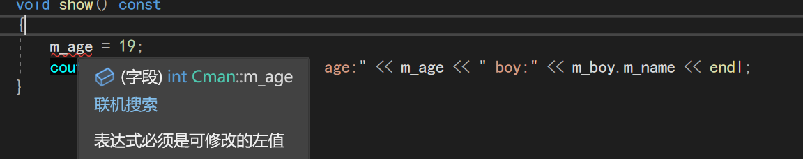

# Chapter 15 类和对象


##  15.1  类的初体验

l 类的成员可以是变量，也可以是函数。

l 类的成员变量也叫属性。

l 类的成员函数也叫方法/行为，**类的成员函数可以定义在类的外面。**

l 用类定义一个类的变量叫创建（或实例化）一个对象。

l 对象的成员变量和成员函数的作用域和生命周期与对象的作用域和生命周期相同。

下面演示类的成员函数定义在类的外面:

```c++
class Cman
{
    public:
      string gender ;
      int age ;
      stirng name ;
      void show( );
      void setval(string name ,string gender ,int age);
}
//外部定义成员函数:
void Cman::show()
{
     cout<<"name: ": <<name
         << " age: "<<age 
         <<" gender:"<< gender<<endl;
}
void Cman::setval(string Name ,string Gender ,int Age)
{
    name =Name ;
    gender = Gender;
    age = Age;
}
```

- 注`::`为作用域解析运算符
- 注**区分成员变量 和需要赋予的常量名**

视频的老师有一个很好的习惯:

​    他喜欢在结构体变量前加上前缀`st`

​              在 类前加上前缀`C`

## 15.2类的访问权限

类的成员有三种访问权限：public、private和protected，分别表示公有的、私有的和受保护的。

在类的内部（类的成员函数中），无论成员被声明为 public还是private，都可以访问。

在类的外部（定义类的代码之外），只能访问public成员，不能访问 private、protected成员。

在一个类体的定义中，private 和 public 可以出现多次。

**结构体的成员缺省为public，类的成员缺省为private。**

**private的意义在于隐藏类的数据和实现，把需要向外暴露的成员声明为public。**


## 15.3 类的使用

- 类的成员函数可以调用其他成员函数(**也可以递归**)

类的成员函数可以借助**成员变量保存数据**(在递归中很实用)

- 类的成员函数可以重载，可以使用默认参数。
- 对象可以作为实参传递给函数，一般传引用
- 在类的外部，一般不直接访问（读和写）对象的成员，而是用成员函数。数据隐藏是面向对象编程的思想之一。(我觉得有点抽象了)先别管吧

- **对象一般不用memset()清空成员变量，可以写一个专用于清空成员变量的成员函数。**

<font color = blue>非常重要!!!! ,假设成员变量中有一个指针类型的变量,使用memset()进行清零后:**地址值也被清零**这样将导致:</font>

​           1）指针类型的变量指向一段空地址,后续无法对p指针进行操作

​           2）造成**内存泄漏** 无法指向原先分配的内存地址

- 对类和对象用sizeof运算意义不大，一般不用。

- 用结构体描述纯粹的数据，用类描述对象

- 为了区分类的成员变量和成员函数的形参，**把成员变量名加m_前缀或_后缀，如m_name或name_。**


## 15.4 构造函数和析构函数

**构造函数：**在创建对象时，自动的进行初始化工作。

**析构函数：**在销毁对象前，自动的完成清理工作。

###    15.4.1 构造函数

```c++
class Cman
{
  .....略去成员变量
  //构造函数  
  Cman(int age ,string gender ,string name)
  {
      m_age = age ;
      m_gender = gender ;
      m_name = name ;
  }
  //
};
```

l 访问权限必须是public。

l 函数名必须与类名相同。

l 没有返回值，不写void。

l 可以有参数，可以重载，可以有默认参数。

l 创建对象时**只会自动调用一次**，不能手工调用。


### 15.4.2 析构函数

只有在成员变量中有需要动态分配内存的才需要调用(释放内存资源)

- 语法：~类名(){......}

​		l 访问权限必须是public。

​		l 函数名必须在类名前加~。

​		l 没有返回值，也不写void。

​		l 没有参数，不能重载。

​		l 销毁对象前只会自动调用一次，但是可以手工调用。


### 15.4.3 注意事项:

1）**在构造函数名后面加括号和参数不是调用构造函数，是创建匿名对象。**

```c++
//在构造函数中
Cman()
{
    Cman();
    .....
}
```

在这行代码中 ,实际上是初始化创建了一个Cman 的匿名对象 其生命周期只存在于Cman匿名函数中  

2)如果说成员变量内有指针 ,未经初始化的指针为野指针 ,如果对其delete 会造成程序的崩溃!

3） 以下两行代码有本质的区别：

```c++
CGirl girl = CGirl("西施"20); // 显式创建对象。

CGirl girl;          // 创建对象。

girl = CGirl("西施"20);     // 创建匿名对象，然后给现有的对象赋值。
```


## 15.6 委托构造(C++11)

实际的开发中，为了满足不同的需求，一个类可能会重载多个构造函数。多个构造函数之间可能会有重复的代码。例如变量初始化，如果在每个构造函数中都写一遍，这样代码会显得臃肿。

**委托构造就是在一个构造函数的初始化列表中调用另一个构造函数**

<font size=4>**注意：**</font>

**l 不要生成环状的构造过程。**

**l 一旦使用委托构造，<font color=red>就不能在初始化列表中初始化其它的成员变量。</font>**

```c++

class AA
{
private:
    int      m_a;
    int      m_b;
    double   m_c;
public:
    // 有一个参数的构造函数，初始化m_c
    AA(double c) {
        m_c = c + 3;     // 初始化m_c
        cout << " AA(double c)" << endl;
    }
    // 有两个参数的构造函数，初始化m_a和m_b
    AA(int a, int b) {
        m_a = a + 1;     // 初始化m_a
        m_b = b + 2;    // 初始化m_b
        cout << " AA(int a, int b)" << endl;
    }
    // 构造函数委托AA(int a, int b)初始化m_a和m_b
    AA(int a, int b, const string& str) : AA(a, b) {
        cout << "m_a=" << m_a << ",m_b=" << m_b << ",str=" << str << endl;
    }
    // 构造函数委托AA(double c)初始化m_c
    AA(double c, const string& str) : AA(c) {
        cout << "m_c=" << m_c << ",str=" << str << endl;
    }
};
```


## 15.6 拷贝构造函数

在C++ 中 ,若希望将已创建的对象赋给新对象,不会调用构造函数 ,而是会调用拷贝构造函数

语法:

```c++
//Cman(...,const Cman & man,....)  省略号可填入其他变量
Cman(const Cman& man)
{
    m_age =man.m_age +1;
    .....
    //return Cman;
}

int main()
{
    Cman sec = Cman(first_people);
}
```


### 15.6.1 函数中对于以值的方式返回对象时:Linux和VS 

- #### Linux中:

  Linux进行了优化 ,若将临时对象或者局部对象返回,不会调用拷贝构造函数 ,用的就是返回的对象的地址

  (如果说直接返回传入的对象,那么我感觉这就像是调用了拷贝构造函数)

  

- #### VS中:

  会调用拷贝函数 ,返回的对象 和需要赋值的对象并非同一个地址

```c++
Cman func(Cman man)
{
   Cman newman = Cman(man); 
   newman.m_age +=1;
   return newman; 
}
```


---


## 15.7 浅拷贝与深拷贝(开发经验)面试常考


###  15.7.1 浅拷贝

 假若成员内有指针 , 将一个对象拷贝给另一个对象 二者的指针成员会共用一块内存区域


```c++
class Cman
{
    .......
    Cman(const Cman& man)
    {
       m_ptr = man.m_ptr;
       ........
    }
}
```

**<font size=4 face=宋体>这样容易导致以下问题:</font>**

- 当一个对象销毁时 ,另一个对象的指针成员会变成**<font color =purple>野指针</font>**,从而造成程序崩溃

- 引起堆区数据的混乱(因为堆区存放动态开辟的变量)


###  15.7.2 深拷贝

 假若成员内有指针 , 将一个对象拷贝给另一个对象 二者的指针成员**不会共用**一块内存区域

```c++
class Cman
{
    .......
    Cman(const Cman& man)
    {
       m_ptr = new int(*man.m_ptr);
       ........
    }
}
```


## 15.8 初始化列表

构造函数的执行可以分成两个阶段：初始化阶段和计算阶段（初始化阶段先于计算阶段）。

  l 初始化阶段：全部的成员都会在初始化阶段初始化。

  l 计算阶段：一般是指用于执行构造函数体内的赋值操作。<font color=blue>我们在构造函数里面敲的赋值代码都属于该阶段</font>

```c++
class Cman
{
    Cman(int age ,string name):m_age(age),m_name(name)
    {
        .......
    }
}
```


###  15.8.1初始化列表和赋值的区别(没看懂)

1. **初始化列表**：
   - 在对象创建时直接使用初始化列表来初始化成员变量。
   - 如果成员变量是类对象，初始化列表会调用成员变量类的拷贝构造函数（或移动构造函数），而不会调用其默认构造函数。
   - 这种方式通常更高效，因为它避免了先调用默认构造函数再进行赋值的过程。
2. **赋值**：
   - 在对象创建时，首先调用成员变量的默认构造函数来创建成员变量。
   - 然后使用赋值操作将值赋给成员变量。
   - **这意味着会多一次对象的默认构造和赋值操作，可能会<font color=red>降低效率</font>。**

```c++
class Cboy
{
public:
	string m_name;
	Cboy()
	{
		m_name.clear();
		cout << "调用了Cboy()默认构造函数\n";
	}
	Cboy(string name) :m_name(name)
	{
		cout << "调用了Cboy(string name)构造函数\n ";
	}
	Cboy(const Cboy& boy)
	{
		m_name = boy.m_name;
		cout << "调用了Cboy(const Cboy & boy)拷贝构造函数\n";
	}

};
```

- **赋值**

  ```c++
  	Cman(string name, int age,Cboy&boy)//:m_name(name),m_age(age) ,m_boy(boy)
  	{
  		m_name = "fpr";
  		m_age = age;
  		m_boy = boy;
  		cout << "调用了构造函数Cman(string name, int age,Cboy&boy)\n";
  	}
  ```

  

**先初始化 后赋值**

- 初始化列表

  ```c++
  	Cman(string name, int age,Cboy&boy)//:m_name(name),m_age(age) ,m_boy(boy)
  	{
  		//m_name = "fpr";
  		//m_age = age;
  		//m_boy = boy;
  		cout << "调用了构造函数Cman(string name, int age,Cboy&boy)\n";
  	}
  ```

  

**初始化赋值操作一并完成**,因为是调用了<font color=purple>**拷贝构造函数**</font>


###   15.8.2   注意事项

-  **如果成员是常量和引用，必须使用初始列表，因为常量和引用只能在定义的时候初始化**(很好理解,就不展示示例了)


## 15.9 const修饰成员函数(编程规范)

在类的成员函数后面加const关键字，表示在成员函数中保证不会修改调用对象的成员变量。

```c++
void show() const
{
    .........
}

```

若修改,<font face=黑体>**程序报错**</font>




### 15.9.1 this指针

如果类的成员函数中涉及多个对象，在这种情况下需要使用this指针。

this指针存放了对象的地址，它被作为隐藏参数传递给了成员函数，**指向调用成员函数的对象（调用者对象）**。

每个成员函数（包括构造函数和析构函数）都有一个this指针，**可以用它访问调用者对象的成员。（可以解决成员变量名与函数形参名相同的问题）**

如果在成员函数的括号后面使用const，那么将不能通过this指针修改成员变量。

```c++
class Cgirl
{
public:
	string m_name;
	int m_beauty_rk;
    //..........省略构造函数
	const Cgirl& pk(const Cgirl& g) const 
	{
		return (g.m_beauty_rk > this->m_beauty_rk) ? g : *this;
	}
};

int main()
{
	Cgirl g1, g2, g3;
	g1 = Cgirl(1,"三上");
	g2 = Cgirl(2, "桥本");
	g3 = Cgirl(3, "冲田");
	const Cgirl& g = g1.pk(g2).pk(g3); //注意这种写法 C++的特性想一想cout<< << << 运算符有关?
	cout << "最美的女孩是: " <<g.m_name << endl;

}
```


## 15.10 静态成员变量


- 类的静态成员具体类成员的性质 可以通过具体的对象进行访问  ,  用静态成员可以变量实现多个对象之间的数据共享，比全局变量更安全性。

- **如果把类的成员声明为静态的，就可以把它与类的对象独立开来（静态成员不属于对象）。**静态成员变量在程序中只有一份（生命周期与程序运行期相同，存放在静态存储区的），不论是否创建了类的对象，也不论创建了多少个类的对象。

```c++
class CGirl                 // 超女类CGirl。
{
    static int m_age;                        // 年龄属性。
public:
    string      m_name;                    // 姓名属性。

    // 两个参数的普通构造函数。
    CGirl(const string& name, int age) { m_name = name; m_age = age; }
    // 显示超女的姓名。
    void showname()  { cout << "姓名：" << m_name << endl; }
    // 显示超女的年龄。
    static void showage() { cout << "年龄：" << m_age << endl; }
};

int CGirl::m_age=8;        // 初始化类的静态成员变量。

int main()
{
    CGirl g1("西施1", 21), g2("西施2", 22), g3("西施3", 23);

    g1.showname(); g1.showage();
    g2.showname(); g2.showage();
    g3.showname(); g3.showage();

    CGirl::showage();
    // cout << "CGirl::m_age=" << CGirl::m_age << endl;
}

//终端结果 :显示年龄都为23 

```

- 多个对象中的成员会共享一个静态成员变量 ,且无法在某个函数作用域内被修改


## 15.11 简单的对象模型

在C语言中，**数据**和**处理数据的操作（函数）**是分开的。也就是说，C语言本身没有支持**数据和函数**之间的关联性。

C++用类描述抽象数据类型（abstract data type，ADT），在类中定义了**数据**和**函数**，把**数据**和**函数**关联起来。


|静态成员变量属于类 ,在整个程序中只有一份 不会计入到某个对象的占有空间中

l 对象内存的大小包括：1）所有非静态数据成员的大小；2）由内存对齐而填补的内存大小；3）为了支持virtual成员而产生的额外负担。

l 静态成员变量属于类，不计算在对象的大小之内。

l 成员函数是分开存储的，不论对象是否存在都占用存储空间，在内存中只有一个副本，也不计算在对象大小之内。

## 15.12 友元

- 如果要访问类的私有成员变量，调用类的公有成员函数是唯一的办法，而类的私有成员函数则无法访问。

  友元提供了另一访问类的私有成员的方案。友元有三种：

  - l 友元全局函数。

  - l 友元类。

  - l 友元成员函数。

  **1**）**友元全局函数**

     在友元全局函数中，可以访问另一个类的所有成员。

  **2**）**友元类**

     在友元类所有成员函数中，都可以访问另一个类的所有成员。

     友元类的注意事项：

  - l 友元关系**不能被继承**。

  - l 友元关系是单向的，<font color = blue>不具备交换性</font>。

  若类B是类A的友元，类A不一定是类B的友元。B是类A的友元，类C是B的友元，类C不一定是类A的友元，要看类中是否有相应的声明。

​         **3**）**友元成员函数**

在友元成员函数中，可以访问另一个类的所有成员。

如果要把男朋友类CBoy的某成员函数声明为超女类CGirl的友元，声明和定义的顺序如下：

```c++
class CGirl;            // 前置声明。   
class CBoy { ...... };      // CBoy的定义。
class CGirl { ...... };      // CGirl的定义。
                                      
// 友元成员函数的定义。               
void CBoy::func(CGirl &g) { ...... }       

```

