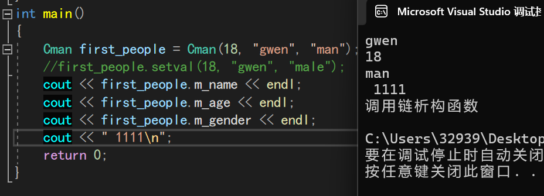

# Chapter 15 类和对象


##  15.1  类的初体验

l 类的成员可以是变量，也可以是函数。

l 类的成员变量也叫属性。

l 类的成员函数也叫方法/行为，**类的成员函数可以定义在类的外面。**

l 用类定义一个类的变量叫创建（或实例化）一个对象。

l 对象的成员变量和成员函数的作用域和生命周期与对象的作用域和生命周期相同。

下面演示类的成员函数定义在类的外面:

```c++
class Cman
{
    public:
      string gender ;
      int age ;
      stirng name ;
      void show( );
      void setval(string name ,string gender ,int age);
}
//外部定义成员函数:
void Cman::show()
{
     cout<<"name: ": <<name
         << " age: "<<age 
         <<" gender:"<< gender<<endl;
}
void Cman::setval(string Name ,string Gender ,int Age)
{
    name =Name ;
    gender = Gender;
    age = Age;
}
```

- 注`::`为作用域解析运算符
- 注**区分成员变量 和需要赋予的常量名**

视频的老师有一个很好的习惯:

​    他喜欢在结构体变量前加上前缀`st`

​              在 类前加上前缀`C`

## 15.2类的访问权限

类的成员有三种访问权限：public、private和protected，分别表示公有的、私有的和受保护的。

在类的内部（类的成员函数中），无论成员被声明为 public还是private，都可以访问。

在类的外部（定义类的代码之外），只能访问public成员，不能访问 private、protected成员。

在一个类体的定义中，private 和 public 可以出现多次。

**结构体的成员缺省为public，类的成员缺省为private。**

**private的意义在于隐藏类的数据和实现，把需要向外暴露的成员声明为public。**


## 15.3 类的使用

- 类的成员函数可以调用其他成员函数(**也可以递归**)

类的成员函数可以借助**成员变量保存数据**

- 类的成员函数可以重载，可以使用默认参数。
- 对象可以作为实参传递给函数，一般传引用
- 在类的外部，一般不直接访问（读和写）对象的成员，而是用成员函数。数据隐藏是面向对象编程的思想之一。(我觉得有点抽象了)先别管吧

- **对象一般不用memset()清空成员变量，可以写一个专用于清空成员变量的成员函数。**

非常重要!!!! ,假设成员变量中有一个指针类型的变量,使用memset()进行清零后:**地址值也被清零**这样将导致:

​           1）指针类型的变量指向一段空地址,后续无法对p指针进行操作

​           2）造成**内存泄漏** 无法指向原先分配的内存地址

- 对类和对象用sizeof运算意义不大，一般不用。

- 用结构体描述纯粹的数据，用类描述对象

- 为了区分类的成员变量和成员函数的形参，**把成员变量名加m_前缀或_后缀，如m_name或name_。**


## 15.4 构造函数和析构函数

**构造函数：**在创建对象时，自动的进行初始化工作。

**析构函数：**在销毁对象前，自动的完成清理工作。

###    15.4.1 构造函数

```c++
class Cman
{
  .....略去成员变量
  //构造函数  
  Cman(int age ,string gender ,string name)
  {
      m_age = age ;
      m_gender = gender ;
      m_name = name ;
  }
  //
};
```

l 访问权限必须是public。

l 函数名必须与类名相同。

l 没有返回值，不写void。

l 可以有参数，可以重载，可以有默认参数。

l 创建对象时**只会自动调用一次**，不能手工调用。


### 15.4.2 析构函数

只有在成员变量中有需要动态分配内存的才需要调用(释放内存资源)

- 语法：~类名(){......}

​		l 访问权限必须是public。

​		l 函数名必须在类名前加~。

​		l 没有返回值，也不写void。

​		l 没有参数，不能重载。

​		l 销毁对象前只会自动调用一次，但是可以手工调用。




### 15.4.3 注意事项:

1）**在构造函数名后面加括号和参数不是调用构造函数，是创建匿名对象。**

```c++
//在构造函数中
Cman()
{
    Cman();
    .....
}
```

在这行代码中 ,实际上是初始化创建了一个Cman 的匿名对象 其生命周期只存在于Cman匿名函数中  

2)如果说成员变量内有指针 ,未经初始化的指针为野指针 ,如果对其delete 会造成程序的崩溃!

3） 以下两行代码有本质的区别：

```c++
CGirl girl = CGirl("西施"20); // 显式创建对象。

CGirl girl;          // 创建对象。

girl = CGirl("西施"20);     // 创建匿名对象，然后给现有的对象赋值。
```


## 15.5 拷贝构造函数

在C++ 中 ,若希望将已创建的对象赋给新对象,不会调用构造函数 ,而是会调用拷贝构造函数

语法:

```c++
//Cman(...,const Cman & man,....)  省略号可填入其他变量
Cman(const Cman& man)
{
    m_age =man.m_age +1;
    .....
    //return Cman;
}

int main()
{
    Cman sec = Cman(first_people);
}
```


### 15.5.1 函数中对于以值的方式返回对象时:Linux和VS 

- #### Linux中:

  Linux进行了优化 ,若将对象返回,不会调用拷贝构造函数 ,用的就是返回的对象的地址

  **如果说,在函数内直接将传递的对象的引用进行return (return 非对象的引用,而是对象), 在return后,仍然会调用拷贝构造函数**

  

- #### VS中:

  会调用拷贝函数 ,返回的对象 和需要赋值的对象并非同一个地址

```c++
Cman func(Cman man)
{
   Cman newman = Cman(man); 
   newman.m_age +=1;
   return newman; 
}
```

