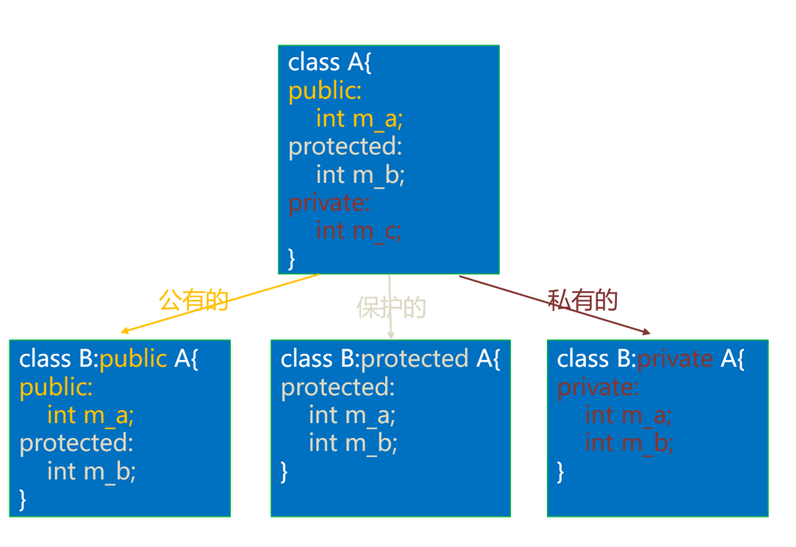
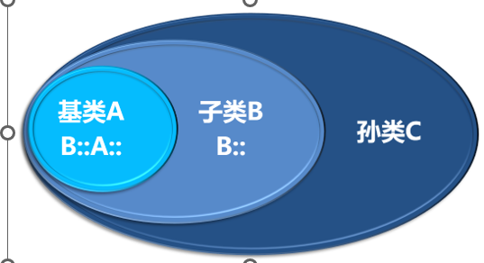

# Chapter 17 类的继承

继承可以理解为一个类从另一个类获取成员变量和成员函数的过程。

语法：

```c++
class 派生类名:［继承方式］基类名
{
  派生类新增加的成员
}; 
```

被继承的类称为基类或父类，继承的类称为派生类或子类。


## 17.1 类的继承方式


继承方式有三种：public（公有的）、protected（受保护的）和[private](https://so.csdn.net/so/search?q=private&spm=1001.2101.3001.7020)（私有的）。它是可选的，如果不写，那么默认为private。不同的继承方式决定了在派生类中成员函数中访问基类成员的权限。


- public

  由于 protected 和 private 继承方式较为复杂 ,一般使用 public

- protected

​       **当继承方式为protected时，那么基类成员在派生类中的访问权限最高也为protected，高于protected的会降级为protected，但低于protected不会升级。**

- private 

  同样访问权限也全部会降级为private



<font color = red>也就是说，继承方式中的public、protected、private是用来指明基类成员在派生类中的最高访问权限的。**不管继承方式如何，基类中的private成员在派生类中始终不能使用**（不能在派生类的成员函数中访问或调用）。</font>


###    17.1.1 类成员的继承

只说一点<font color = blue>基态类的私有成员变量以及函数 , 在派生类的成员中不得使用!! 但是可以通过继承的基态类的**受保护或公有成员函数**</font>进行使用 


###    17.1.2 using改变派生成员的继承方式

<font color = red>**using只能改变基类中public和protected成员的访问权限，不能改变private成员的访问权限，因为基类中的private成员在派生类中是不可见的，根本不能使用**</font>


```c++
访问权限:
   using 基类名::基类成员名 ; //将权限修改
```


## 17.2 继承对象的模型


###     17.2.1 派生类对象的构造和析构过程

1）创建派生类对象时只会**申请一次内存**，派生类对象包含了基类对象的内存空间，this指针相同的。

2）创建派生类对象时，<font color = purple>先调用基类的构造函数，再调用派生类的构造函数。</font>

3）销毁派生类对象时，<font color = purple>先调用派生类的析构函数，再调用基类的析构函数。</font>**如果手工调用派生类的析构函数，也会调用基类的析构函数。**


```c++

class A
{
public:
	int m_a;
	A() :m_a(0), m_b(0), m_c(0)
	{
		cout << "调用了基类构造函数A()\n";
	}
	A(int a, int c) : m_a(a), m_b(0), m_c(c)
	{
		cout << "调用了基类构造函数A(int a ,int c)\n";
		show();
	}
	void* operator new(size_t size)
	{
		cout << "调用了基类的new重载\n";
		void* p = malloc(size);
		cout << "基类的起始地址为:" << p << " size:" <<size<< endl;
		return p;
	}

	void show()
	{
		cout << "m_a: " << &m_a <<"\nm_b: "<< &m_b<<"\nm_c: "<<&m_c<<endl;
	}
protected:
	int m_b;
private:
	int m_c;
};

class B :public A        // 派生类
{
public:
	int m_d = 40;
	B() {
		cout << "m_a: " << &m_a << "\nm_b: " << &m_b <<  endl;
		cout << "m_d：" << &m_d << endl;
	}
	B(int a, int c) : A(a, c)
	{
		cout << "调用了派生类构造函数B(int a ,int c)\n";
		cout << "m_a: " << &m_a << "\nm_b: " << &m_b << endl;
		cout << "m_d：" << &m_d << endl;
	}
};

int main()
{
	B* b = new B(1, 1);
	free(b);
}
```

在上述代码中分别在基类和派生类中需调用的构造函数中打印了各成员变量的地址 ,发现:

- 两次构造函数都是对<font color=blue>同一区域内存进行操作 </font>
- 分配内存时 **分配16 字节** ,而原本A对象只需要12字节 只有B对象需要16字节


###      17.2.2 派生类对象的初始化列表

初始化列表可调用基态的**构造函数以及拷贝构造函数**

- 构造函数

```c++
B():A(),m_d(0)
{
    ......
}
B(int a , int c):A(a,c) , m_d(0)
{
    ......
}
```

- 拷贝构造函数

```c++
B(const A& a , int d):A(a) , m_d(d)
{
    ......
}
```


## 17.3 名字遮蔽与作用域

当存在继承关系时，基类的作用域嵌套在派生类的作用域中。如果成员在派生类的作用域中已经找到，就不会在基类作用域中继续查找；如果没有找到，则继续在基类作用域中查找。

注意：基类的成员函数和派生类的成员函数不会构成重载，<font color = red>**如果派生类有同名函数，那么就会遮蔽基类中的所有同名函数**</font>。

如果在成员的前面加上类名和域解析符，就可以直接使用该作用域的成员。

​                                    

```c++
class A {        // 基类
public:
    int m_a=10;
    void func() { cout << "调用了A的func()函数。\n"; }
};
               
class B :public A {       // 子类
public:
    int m_a = 20;
    void func() { cout << "调用了B的func()函数。\n"; }
};
           
class C :public B {       // 孙类
public:
    int m_a = 30;
    void func() { cout << "调用了C的func()函数。\n"; }
    void show() {
        cout << "C::m_a的值是：" << C::m_a << endl;
        cout << "B::m_a的值是：" << B::m_a << endl;
        cout << "A::m_a的值是：" << B::A::m_a << endl;
    }
};
           
int main()
{           
    C c;
    cout << "C::m_a的值是：" << c.C::m_a << endl;
    cout << "B::m_a的值是：" << c.B::m_a << endl;
    cout << "A::m_a的值是：" << c.B::A::m_a << endl;
    c.C::func();
    c.B::func();
    c.B::A::func();
}
```


## 17.4 继承的特殊关系

派生类和基类之间有一些特殊关系。

1）如果继承方式是公有的，派生类对象可以使用基类成员。

2）可以把派生类对象赋值给基类对象（包括私有成员），但是，会舍弃非基类的成员。

3）**基类指针可以在不进行显式转换的情况下指向派生类对象。**

4）**基类引用可以在不进行显式转换的情况下引用派生类对象。**

注意：

1）基类指针或引用只能调用基类的方法，不能调用派生类的方法。

2）可以用派生类构造基类。

3）如果函数的形参是基类，实参可以用派生类。

```c++
class A {        // 基类
public:
    int m_a=0;
private:
    int m_b=0;
public:
    // 显示基类A全部的成员。
    void show() { cout << "A::show() m_a=" << m_a << ",m_b=" << m_b << endl; }
    // 设置成员m_b的值。
    void setb(int b) { m_b = b;  }
};

class B :public A        // 派生类
{
public:
    int m_c=0;
    // 显示派生类B全部的成员。
    void show() { cout << "B::show() m_a=" << m_a << "m_c=" << m_c << endl; }
};

int main()
{
    B b;
    A* a = &b;

    b.m_a = 10; 
    b.setb(20);          // 设置成员m_b的值。
    b.m_c = 30;
    b.show();            // 调用的是B类的show()函数。

    a->m_a = 11;
    a->setb(22);          // 设置成员m_b的值。
    // a->m_c = 30;
    
    a->show();         // 调用的是A类的show()函数。
}
```


## 17.5 cl命令

查看对象内存布局的方法：

cl 源文件名 /d1 reportSingleClassLayout类名

**注意：类名不要太短，否则屏幕会显示一大堆东西，找起来很麻烦。**

例如，查看BBB类，源代码文件是`demo01.cpp：`

`cl demo01.cpp /d1 reportSingleClassLayoutBBB`


##  17.6 析构派生类

用基类指针指向派生类对象时，delete基类指针调用的是基类的析构函数，不是派生类的，如果希望调用派生类的析构函数，就要把基类的析构函数设置为虚函数
