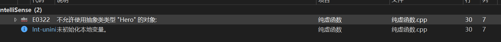

# Chapter 18 类的多态


## 18.1 类的多态的定义

假设有一群厨师 , 他们有共同的属性(虽然属性值各不相同) , 有一些共同炒菜的技巧,但是 ,这些技巧各不相同, 无法用某一基类内部函数进行继承 ,而需要对该函数进行重构 , 实现个性化的需求 ,这也就衍生出了多态


如果在基类的**成员函数前加**`virtual` 关键字，**把它声明为虚函数**，<font color =red>基类指针就可以调用派生类中同名的成员函数</font>，通过派生类中同名的成员函数，就可以访问派生对象的成员变量。

有了虚函数，基类指针指向基类对象时就使用基类的成员函数和数据，指向派生类对象时就使用派生类的成员函数和数据，<font color = red>**基类指针表现出了多种形式，这种现象称为多态**。</font>


注意：(**都很重要值得一看**)

1）只需要在基类的函数声明中加上virtual关键字，函数定义时不能加。

2）在派生类中重定义虚函数时，**函数特征要相同**。

3）当在基类中定义了虚函数时，如果派生类没有重定义该函数，那么将使用基类的虚函数。

4）在派生类中重定义了虚函数的情况下，如果想使用基类的虚函数，可以加类名和域解析符。

5）如果要在派生类中重新定义基类的函数，则将它设置为虚函数；否则，不要设置为虚函数，有两方面的好处：首先效率更高；其次，指出不要重新定义该函数。<font color=purple>(开发经验)</font>


##  18.2 多态模型


类的普通成员函数的地址是静态的，在编译阶段已指定。

如果基类中有虚函数，对象的内存模型中有一个虚函数表，表中存放了基类的函数名和地址。

如果派生类中重定义了基类的虚函数，创建派生类对象时，将用派生类的函数取代虚函数表中基类的函数。


- #### C++中的多态分为两种：静态多态与动态多态。

静态多态：也成为编译时的多态；在编译时期就已经确定要执行了的函数地址了；主要有函数重载和函数模板。

动态多态：即动态绑定，在运行时才去确定对象类型和正确选择需要调用的函数，一般用于解决基类指针或引用派生类对象调用类中重写的方法（函数）时出现的问题。


##  18.3 纯虚函数和抽象类

**纯虚函数**是一种特殊的虚函数，在某些情况下，[基类](https://baike.baidu.com/item/基类/9589663)中不能对[虚函数](https://baike.baidu.com/item/虚函数/2912832)给出有意义的[实现](https://baike.baidu.com/item/实现/10801654)，把它声明为纯虚函数。 而含有纯虚函数的类也就是**抽象类**

语法：`virtual 返回值类型 函数名 (参数列表)=0;`


抽象类**无法作为实例化对象**, 但是可以进行指针或者引用, **派生类必须重定义抽象类中的纯虚函数**，否则也属于抽象类。



<font color =grey>PS:基类中的纯虚析构函数也需要实现。有时候，想使一个类成为抽象类，但刚好又没有任何纯虚函数，怎么办？方法很简单：在想要成为抽象类的类中声明一个纯虚析构函数。</font>


```c++
class Hero
{
public:
	int m_hp;
	virtual void skill1() = 0;
	Hero(int hp) : m_hp(hp)
	{cout << "调用了Hero(int hp)\n";}
};

class XS:public Hero
{
public:
	XS(int hp) :Hero(hp)
	{cout << "调用了XS(int hp)\n";}
	void skill1()
    {cout << "调用了XS的一技能\n";}
};
int main()
{
	//Hero a;
	return 0;
}
```


##   18.4 dynamic_cast类型识别

多态核心思想是 用基类指针 指向派生类对象,从何调用派生类函数 ,但是产生了一个新的问题 ,如何知道积基类指针指向的那个对象呢?

可以使用`dynamic_cast`:

语法：`派生类指针 = dynamic_cast<派生类类型 *>(基类指针);`

如果转换成功，`dynamic_cast`返回对象的地址，如果失败，返回`nullptr`。


注意：

1）dynamic_cast只适用于包含虚函数的类。

2）dynamic_cast可以将派生类指针转换为基类指针，这种画蛇添足的做法没有意义。

3）dynamic_cast可以用于引用，但是，没有与空指针对应的引用值，如果转换请求不正确，会出现bad_cast异常。


```c++
	// 如果基类指针指向的对象是西施，那么就调用西施的show()函数。
		//if (id == 1) {
		//	XS* pxs = (XS *)ptr;             // C风格强制转换的方法，程序员必须保证目标类型正确。
		//	pxs->show();
		//}
		XS* xsptr = dynamic_cast<XS*>(ptr);         // 把基类指针转换为派生类。
		if (xsptr != nullptr) xsptr->show();        // 如果转换成功，调用派生类西施的非虚函数。

```


## 18.5 typeid

typeid运算符用于获取数据类型的信息。

l 语法一：`typeid(数据类型);`

l 语法二：`typeid(变量名或表达式);`

`typeid`运算符返回`type_info`类（在头文件`<typeinfo>`中定义）的对象的引用。

`type_info`类的实现随编译器而异，但至少有`name()`成员函数，该函数返回一个字符串，通常是类名。


注意:

1）`typeid`运算符可以用于多态的场景，在运行阶段识别对象的数据类型。

2）假设有表达式`typeid(ptr)`，当`ptr`是空指针时，如果`ptr`是多态的类型，将引发`bad_typeid`异常。

```c++
    // type_info重载了==和!=运算符，用于对类型进行比较。 以下例子为常见用法
    if (typeid(AA) == typeid(aa))     cout << "ok1\n";
    if (typeid(AA) == typeid(*paa)) cout << "ok2\n";
    if (typeid(AA) == typeid(raa))    cout << "ok3\n";
    if (typeid(AA*) == typeid(paa))   cout << "ok4\n";

```

