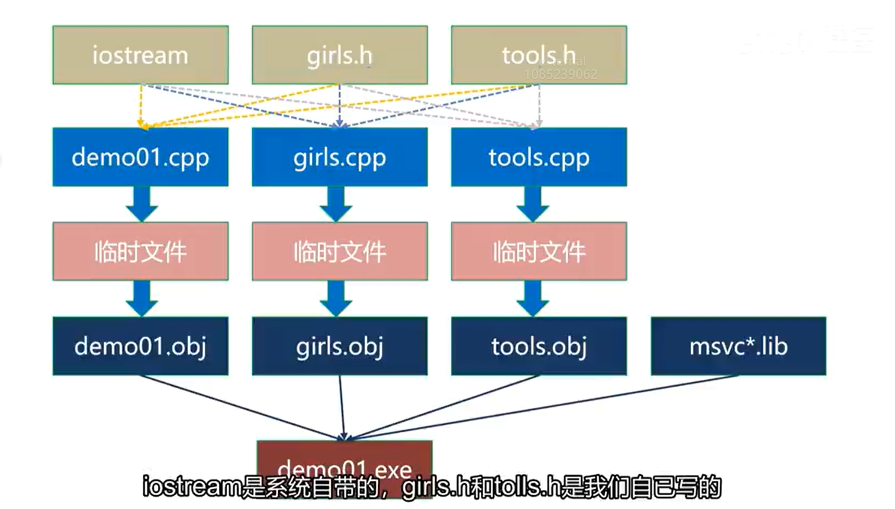

# Chapter 21 C++编译,链接和命名空间


##   21.1 编译预处理

C++程序编译的过程：预处理 -> 编译（优化、汇编）-> 链接

预处理指令主要有以下三种：

- l 包含头文件：`#include`

- l 宏定义：`#define`（定义宏）、`#undef`（删除宏）

- l 条件编译：`#ifdef`、`#ifndef`。


**1**）**包含头文件**

`#include` 包含[头文件](https://so.csdn.net/so/search?q=头文件&spm=1001.2101.3001.7020)有两种方式：

-  `#include `<文件名>：直接从编译器自带的函数库目录中寻找文件。

-  `#include `"文件名"：先从自定义的目录中寻找文件，如果找不到，再从编译器自带的函数库目录中寻找。


**2**）**宏定义指令**

编译的时候，编译器把程序中的宏名用宏内容替换，是为宏展开（宏替换）。

C++中常用的宏：

- l 当前源代码文件名：`__FILE__`

- l 当前源代码函数名：`__FUNCTION__`

- l 当前源代码行号：`__LINE__`

- l 编译的日期：`__DATE__`

- l 编译的时间：`__TIME__`

- l 编译的时间戳：`__TIMESTAMP`__

- l 当用C++编译程序时，宏`__cplusplus`就会被定义。


**3**）**条件编译**

最常用的两种：`#ifdef`、`#ifndef`  if #define  / if not #define

相较于普通if else 语句 , 条件编译只会选择满足条件的语句进行编译 ,**另一个不编译**


**4**）**解决头文件中代码重复包含的问题**

在C/C++中，在使用预编译指令#include的时候，为了防止头文件被重复包含，有两种方式。

**第一种：用`#ifndef`指令。**

```c++
#ifndef _GIRL_

#define _GIRL_

 //代码内容。

#endif 
```

**第二种：把**`#pragma once`**指令放在文件的开头。**

\#ifndef方式受C/C++语言标准的支持，不受编译器的任何限制；**而#pragma once方式有些编译器不支持**。

\#ifndef可以针对文件中的部分代码；而#pragma once只能针对整个文件。

\#ifndef更加灵活，兼容性好；#pragma once操作简单，效率高。


##  21.2 编译和链接


###   21.2.1 源代码的组织

**头文件（\*.h）：**`#include`头文件、函数的声明、结构体的声明、类的声明、模板的声明、内联函数、`#define`和`const`定义的常量等。

**源文件（\*.cpp）：**函数的定义、类的定义、模板具体化的定义。

**主程序（main函数所在的程序）：**主程序负责实现框架和核心流程，把需要用到的头文件用#include包含进来。


###   21.2.2 编译预处理

**预处理的包括以下方面：** 

1）处理#include头文件包含指令。

2）处理#ifdef #else #endif、#ifndef #else #endif条件编译指令。

3）处理#define宏定义。

4）为代码添加行号、文件名和函数名。

5）删除注释。

6）保留部分#pragma编译指令（编译的时候会用到）。


###   21.2.3 编译

将预处理生成的文件，经过法分析、语法分析、语义分析以及优化和汇编后，编译成若干个目标文件（二进制文件）。


###  21.2.4链接

将编译后的目标文件，以及它们所需要的库文件链接在一起，形成一个体整。


下图展示的是 从源文件到可执行文件 生成的全过程




###    21.2.5 更多细节

1）分开编译的好处：每次只编译修改过的源文件，然后再链接，效率最高。

2）编译单个*.cpp文件的时候，必须要让编译器知道名称的存在，否则会出现找不到标识符的错误。（直接和间接包含头文件都可以）

3）编译单个*.cpp文件的时候，<font color =red>编译器只需要知道名称的存在，**不会把它们的定义一起编译**。</font>,比方说你在主程序中调用了某个函数 并在头文件中声明该函数 , 但未在源文件进行定义 , **此时单独编译主程序不会报错**

4）**如果函数和类的定义不存在**，编译不会报错，**但链接会出现无法解析的外部命令**。

5）链接的时候，变量、函数和类的定义只能有一个，**否则会出现重定义的错误**。（如果把变量、函数和类的定义放在*.h文件中，*.h会被多次包含，链接前可能存在多个副本；如果放在*.cpp文件中，*.cpp文件不会被包含，只会被编译一次，链接前只存在一个版本）

6）把变量、函数和类的定义放在*.h中是不规范的做法，如果*.h被多个*.cpp包含，会出现重定义。

7）用#include包含*.cpp也是不规范的做法，原理同上。

8）尽可能不使用全局变量，如果一定要用，**要在*.h文件中声明（需要加extern关键字），在*.cpp文件中定义**。

9）全局的const常量在头文件中定义（**const常量仅在单个文件内有效**）。

10）*.h文件重复包含的处理方法只对单个的*.cpp文件有效，不是整个项目。

11）函数模板和类模板的声明和定义可以分开书写，<font color =purple>**但它们的定义并不是真实的定义，只能放在*.h文件中；**</font>函数模板和类模板的具体化版本的代码是真实的定义，所以放在*.cpp文件中。

12）Linux下C++编译和链接的原理与VS一样。


##   21.3 命名空间

在实际开发中，较大型的项目会使用大量的全局名字，如类、函数、模板、变量等，很容易出现名字冲突的情况。

命名空间分割了全局空间，每个命名空间是一个作用域，防止名字冲突。


###  	21.3.1 创建命名空间

```c++
namespace "空间名"(可省略 , 若省略则为匿名空间)
{
    // 类、函数、模板、变量的声明和定义。
    ......
}
```


###  	21.3.2  使用命名空间

在同一命名空间内的名字可以直接访问，该命名空间之外的代码则必须明确指出命名空间。

1）运算符`::`

语法：命名空间::名字

简单明了，且不会造成任何冲突，但使用起来比较繁琐。

2）`using`声明

语法：`using 命名空间::名字`

用`using`声明名后，就可以进行直接使用名称。

如果该声明区域<font color =red>**有相同的名字，则会报错。**</font>

3）`using`编译指令

语法：`using namespace`命名空间

`using`编译指令将使整个命名空间中的名字可用。如果声明区域有相同的名字，局部版本将隐藏命名空间中的名字，不过，可以使用域名解析符使用命名空间中的名称。


### 	21.3.3 注意事项

1）命名空间是全局的，可以分布在多个文件中。

2）命名空间可以嵌套。

3）在命名空间中声明全局变量，而不是使用外部全局变量和静态变量。

4）**对于using声明，首选将其作用域设置为局部而不是全局。**

   **局部作用域 vs. 全局作用域:**

- **局部作用域**: `using` 声明被限制在一个函数或代码块内，只在这个作用域中有效。离开这个作用域后，`using` 声明的效果不再存在。例如：

  ```
  cpp复制代码void myFunction() {
      using std::cout;
      cout << "This is local" << std::endl;
  }
  
  void anotherFunction() {
      // cout is not directly available here
      std::cout << "This is another function" << std::endl;
  }
  ```

  在这个例子中，`cout` 的使用被限制在 `myFunction` 函数内部，其他地方不会受到影响。

- **全局作用域**: `using` 声明在全局范围内（例如在文件的最开始）使用，使得在整个文件中都能直接使用引入的名称。例如：

  ```
  cpp复制代码using std::cout;
  using std::endl;
  
  void myFunction() {
      cout << "This is global" << endl;
  }
  
  void anotherFunction() {
      cout << "This is another function" << endl;
  }
  ```

  在这个例子中，`cout` 和 `endl` 在整个文件中都可以直接使用，这意味着它们的影响是全局的。

  

5）不要在头文件中使用using编译指令，如果非要使用，应将它放在所有的#include之后。

6）匿名的命名空间，从创建的位置到文件结束有效。


##  21.4 C++类型转换-static_cast

其实c++类型转换有4种语句 ,但是其他三种开发使用较少 了解语法即可

C++认为C风格的类型转换过于松散，可能会带来隐患，不够安全。因此推出了新的类型转换来替代C风格的类型转换，**采用更严格的语法检查，降低使用风险。**


```c++
static_cast<目标类型>(表达式);
const_cast<目标类型>(表达式);
reinterpret_cast<目标类型>(表达式);
dynamic_cast<目标类型>(表达式);
```


### 	21.4.1 static_cast

- **用于内置数据类型之间的转换**

  ```c++
  int  ii = 3;
  long ll = ii;                     // 绝对安全，可以隐式转换，不会出现警告。
  double dd = 1.23;
  long ll1 = dd;                  // 可以隐式转换，但是，会出现可能丢失数据的警告。
  long ll2 = (long)dd;              // C风格：显式转换，不会出现警告。
  long ll3 = static_cast<long>(dd);    // C++风格：显式转换，不会出现警告。
  
  ```

  

- **用于指针之间的转换**

  先隐式转换成`void* `再用`static_cast<double*>(pv)`转换成`double*`型

  ```c++
  int ii = 10;
  
  //double* pd1 = &ii;                      // 错误，不能隐式转换。
  double* pd2 = (double*) &ii;      // C风格，强制转换。
  //double* pd3 = static_cast<double*>(&ii);// 错误，static_cast不支持不同类型指针的转换。
  
  void* pv = &ii;                               // 任何类型的指针都可以隐式转换成void*。
  double* pd4 = static_cast<double*>(pv);  // static_cast可以把void *转换成其它类型的指针。
  func(&ii);
  ```

### 	21.4.2 const_cast

static_cast不能丢掉指针（引用）的const和volitale属性，const_cast可以。

```c++
void func(int *ii)
{}

int main(int argc, char* argv[])
{
   const int *aa=nullptr;
   int *bb = (int *)aa;             // C风格，强制转换，丢掉const限定符。
   int* cc = const_cast<int*>(aa);   // C++风格，强制转换，丢掉const限定符。
   func(const_cast<int *>(aa));
}
```


### 	21.4.3 reinterpret_cast

static_cast不能用于转换不同类型的指针（引用）（不考虑有继承关系的情况），reinterpret_cast可以。

reinterpret_cast的意思是**重新解释**，能够将一种对象类型转换为另一种，不管它们是否有关系。

语法：`reinterpret_cast<目标类型>(表达式);`

`<目标类型>`和`(表达式)`中必须有一个是指针（引用）类型。

reinterpret_cast不能丢掉(表达式)的const或volitale属性。

应用场景：

1）reinterpret_cast的第一种用途是改变指针（引用）的类型。

2）reinterpret_cast的第二种用途是将指针（引用）转换成整型变量。整型与指针占用的字节数必须一致，否则会出现警告，转换可能损失精度。

3）reinterpret_cast的第三种用途是将一个整型变量转换成指针（引用）。