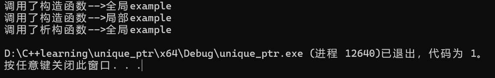
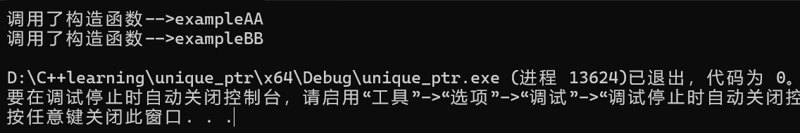

# Chapter 22智能指针


## 22.1 unique_ptr (独享)


### 	22.1.1 定义

`unique_ptr`独享它指向的对象，也就是说，同时只有一个`unique_ptr`指向同一个对象，当这个`unique_ptr`被销毁时，指向的对象也随即被销毁。

包含头文件`#include<memory>`

```c++
template <typename T, typename D = default_delete<T>>
class unique_ptr
{
public:
	explicit unique_ptr(pointer p) noexcept;	// 不可用于转换函数。
	~unique_ptr() noexcept;    
	T& operator*() const;            // 重载*操作符。
	T* operator->() const noexcept;  // 重载->操作符。
	unique_ptr(const unique_ptr &) = delete;   // 禁用拷贝构造函数。
	unique_ptr& operator=(const unique_ptr &) = delete;  // 禁用赋值函数。
	unique_ptr(unique_ptr &&) noexcept;	  // 右值引用。
	unique_ptr& operator=(unique_ptr &&) noexcept;  // 右值引用。
	// ...
private:
	pointer ptr;  // 内置的指针。
};
第一个模板参数T：指针指向的数据类型。
第二个模板参数D：指定删除器，缺省用delete释放资源。

```

- **一般来说删除器 缺省即可**

- **unique_ptr定义被要求一个对象仅管理一个原始指针, 因此禁用了拷贝构造函数 与赋值函数,这样也可以防止程序员犯错**

  

###  	22.1.2 基本用法

**1）初始化**

**方法一：**(这种初始化方式最好,避免了显示创造原始指针 且是C++11标准)

```c++
unique_ptr<AA> p0(new AA("西施"));   // 分配内存并初始化。
```

**方法二：**

```c++
unique_ptr<AA> p0 = make_unique<AA>("西施");  // C++14标准。

unique_ptr<int> pp1=make_unique<int>();     // 数据类型为int。

unique_ptr<AA> pp2 = make_unique<AA>();    // 数据类型为AA，默认构造函数。

unique_ptr<AA> pp3 = make_unique<AA>("西施"); // 数据类型为AA，一个参数的构造函数。

unique_ptr<AA> pp4 = make_unique<AA>("西施",8); // 数据类型为AA，两个参数的构造函数。

AA* p = new AA("西施");unique_ptr<AA> p0 = make_unique<AA>("西施");  // C++14标准

unique_ptr<AA> pp3 = make_unique<AA>("西施"); // 数据类型为AA，一个参数的构造函数。
```

<font color =grey>**方法三（不推荐）**：</font>

```c++
AA* p = new AA("西施");
unique_ptr<AA> p0(p);                  // 用已存在的地址初始化。
```


**2）使用方法**

l <font color=red>**智能指针重载了*和->操作符，可以像使用指针一样使用unique_ptr。**</font>

l 不支持普通的拷贝和赋值。

```c++
   AA* p = new AA("西施");
   unique_ptr<AA> pu2 = p;       // 错误，不能把普通指针直接赋给智能指针。
   unique_ptr<AA> pu3 = new AA("西施"); // 错误，不能把普通指针直接赋给智能指针。
   unique_ptr<AA> pu2 = pu1;      // 错误，不能用其它unique_ptr拷贝构造。
   unique_ptr<AA> pu3;
   pu3 = pu1;              // 错误，不能用=对unique_ptr进行赋值。
```

l 不要用同一个裸指针初始化多个unique_ptr对象。

l get()方法返回裸指针。

l 不要用unique_ptr管理不是new分配的内存。

**3）用于函数的参数**

l 传引用（不能传值，因为unique_ptr没有拷贝构造函数）[^unique_ptr本质是一个对象]。

l 裸指针。

**4）不支持指针的运算（+、-、++、--）**


### 	22.1.3 更多细节(面试常考)


1) **`unique_ptr`本质上是一个类,它将原始指针进行了封装, 由其内部成员函数进行操作, 故A3和A1地址值不相同**

```c++
int main()
{
	AA* A1;
	A1 = new AA("example");
	unique_ptr<AA> A3(A1);
	
	cout << "原始指针的值"<<A1 << endl;
	cout << "A3的值      " << A3 << endl;
	cout << "A3的地址值  " << &A3 << endl;
}
```


2. **将一个unique_ptr赋给另一个时，如果源unique_ptr是一个临时右值，编译器允许这样做**；如果源unique_ptr将存在一段时间，编译器禁止这样做。<font color=purple>**一般用于函数的返回值**</font>。

```c++
unique_ptr<AA> func1(){
	unique_ptr<AA> pu(new AA("example func1"));
	return pu;
}

int main()
{
	unique_ptr<AA> pu1(new AA("example"));
	cout << "调用func1 赋值给pu1\n";
	pu1 = func1();
}
//上述代码可行
```


3. `unique_ptr`不是绝对安全，如果程序中调用`exit()`退出，全局的`unique_ptr`可以自动释放，但局部的`unique_ptr`无法释放。

​	**可以将函数外部,声明在文件中的变量称为全局变量**

```c++
unique_ptr<AA> pu(new AA("全局example"));

int main()
{
	unique_ptr<AA> pu1(new AA("局部example"));
	exit(1);
}
```




4. `reset()`释放对象。

```c++
void reset(T * _ptr= (T *) nullptr);

pp.reset();    // 释放pp对象指向的资源对象。

pp.reset(nullptr); // 释放pp对象指向的资源对象

pp.reset(new AA("bbb")); // 释放pp指向的资源对象，同时指向新的对象。
```

5. swap()交换两个unique_ptr的控制权。

```c++
void swap(unique_ptr<T> &_Right);
```


6. **unique_ptr也可象普通指针那样，当指向一个类继承体系的基类对象时，也具有多态性质**，如同使用裸指针管理基类对象和派生类对象那样。

   

7. `unique_ptr`提供了支持数组的具体化版本。

```c++
//数组版本的unique_ptr，重载了操作符[]，操作符[]返回的是引用，可以作为左值使用。
unique_ptr<int[]> parr1(new int[3]);     // 不指定初始值。

unique_ptr<int[]> parr1(new int[3]{ 33,22,11 }); // 指定初始值。
```

8. 对于`unique_ptr`的管理权限**

- release()释放对原始指针的控制权，将unique_ptr置为空，返回裸指针。（**可用于把unique_ptr传递给子函数，子函数将负责释放对象**）

- `std::move()`可以转移对原始指针的控制权。（**可用于把unique_ptr传递给子函数，子函数形参也是unique_ptr**）

```c++
/*加了const约束说明 不对指针负责*/

// 函数func1()需要一个指针，但不对这个指针负责。
void func1(const AA* a) {
	cout << a->m_name << endl;
}

// 函数func2()需要一个指针，并且会对这个指针负责。
void func2(AA* a) {
	cout << a->m_name << endl;
	delete a;
}

// 函数func3()需要一个unique_ptr，不会对这个unique_ptr负责。
void func3(const unique_ptr<AA> &a) {
	cout << a->m_name << endl;
}

// 函数func4()需要一个unique_ptr，并且会对这个unique_ptr负责。
void func4(unique_ptr<AA> a) {
	cout << a->m_name << endl;
}

int main()
{
	unique_ptr<AA> pu(new AA("西施"));

	cout << "开始调用函数。\n";
	func1(pu.get());     // 函数func1()需要一个指针，但不对这个指针负责。
	func2(pu.release()); // 函数func2()需要一个指针，并且会对这个指针负责。
	func3(pu);           // 函数func3()需要一个unique_ptr，不会对这个unique_ptr负责。
	func4(move(pu));     // 函数func4()需要一个unique_ptr，并且会对这个unique_ptr负责。
	cout << "调用函数完成。\n";

	if (pu == nullptr) cout << "pu是空指针。\n";
}

```


## 22.2 shared_ptr(共享)


### 	22.2.1 定义

**shared_ptr共享它指向的对象，多个shared_ptr可以指向（关联）相同的对象，在内部采用计数机制来实现。**

- 当新的shared_ptr与对象关联时，引用计数增加1

- 当shared_ptr超出作用域时，引用计数减1

- 当引用计数变为0时，则表示没有任何shared_ptr与对象关联，则释放该对象。


### 	22.2.2 基本用法

**1）初始化**

**方法一：**

```c++
shared_ptr<AA> p0(new AA("西施"));   // 分配内存并初始化。
```

**方法二(推荐)：**

```c++
shared_ptr<AA> p0 = make_shared<AA>("西施"); // C++11标准，效率更高。

shared_ptr<int> pp1=make_shared<int>();     // 数据类型为int。

shared_ptr<AA> pp2 = make_shared<AA>();    // 数据类型为AA，默认构造函数。

shared_ptr<AA> pp3 = make_shared<AA>("西施"); // 数据类型为AA，一个参数的构造函数。

shared_ptr<AA> pp4 = make_shared<AA>("西施",8); // 数据类型为AA，两个参数的构造函数。
```

**方法三：**

```c++
AA* p = new AA("西施");
shared_ptr<AA> p0(p);         // 用已存在的地址初始化。
```

**方法四：**

```c++
shared_ptr<AA> p0(new AA("西施")); 

shared_ptr<AA> p1(p0);         // 用已存在的shared_ptr初始化，计数加1。

shared_ptr<AA> p1=p0;         // 用已存在的shared_ptr初始化，计数加1。
```


**2）使用方法**

- l智能指针重载了*和->操作符，可以像使用指针一样使用shared_ptr。

- `use_count()`方法返回引用计数器的值。

- `unique()`方法，如果`use_count()`为1，返回true，否则返回false。

- get()方法返回裸指针。
-  **不要用同一个裸指针初始化多个shared_ptr。**
-  不要用shared_ptr管理不是new分配的内存。

### 	22.2.3 更多细节

1. **`shared_ptr`不支持release()的操作**,但是他存在拷贝构造函数和赋值函数
2. 用nullptr给shared_ptr赋值将把计数减1，如果计数为0，将释放对象，空的shared_ptr==nullptr。<font color =grey >类似于套接字引用计数</font>
3. std::move()可以转移对原始指针的控制权。还可以将unique_ptr转移成shared_ptr。
4. reset()改变与资源的关联关系。

```c++
pp.reset();     // 解除与资源的关系，资源的引用计数减1。

pp. reset(new AA("bbb"));  // 解除与资源的关系，资源的引用计数减1。关联新资源。
```

5. shared_ptr的线程安全性：

- l shared_ptr的引用计数本身是线程安全（引用计数是原子操作）。

- l 多个线程同时读同一个shared_ptr对象是线程安全的。

- l 如果是多个线程对同一个shared_ptr对象进行读和写，则需要加锁。

- l 多线程读写shared_ptr所指向的同一个对象，不管是相同的shared_ptr对象，还是不同的shared_ptr对象，也需要加锁保护。

6. **如果unique_ptr能解决问题，就不要用shared_ptr。unique_ptr的效率更高，占用的资源更少。**
7. 其他同unique_ptr


## 22.3 weak_ptr(针对shared_ptr的循环引用)


### 	22.3.1 shared_ptr存在的问题

shared_ptr内部维护了一个共享的引用计数器，多个shared_ptr可以指向同一个资源。如果出现了**循环引用的情况，引用计数永远无法归0，资源不会被释放。**

请看示例代码：

```c++
class AA
{
public:
	string m_name;
	shared_ptr<BB> m_pub;    //需要将其改成weak_ptr<BB>
	AA(const string name) :m_name(name)
	{cout << "调用了构造函数-->" << m_name<<endl;}
	~AA()
	{cout << "调用了析构函数-->" << m_name<<endl;}
};

class BB
{
public:
	string m_name;
	shared_ptr<AA> m_pua;    //需要将其改成weak_ptr<AA>
	BB(const string name) :m_name(name)
	{cout << "调用了构造函数-->" << m_name << endl;}
	~BB()
	{cout << "调用了析构函数-->" << m_name << endl;}
};

int main()
{
	shared_ptr<AA> pu1(new AA("exampleAA"));
	shared_ptr<BB> pu2(new BB("exampleBB"));
	pu1->m_pub = pu2;
	pu2->m_pua = pu1;
}
```




### 	22.3.2 weak_ptr是什么

`weak_ptr `是为了配合shared_ptr而引入的，它指向一个由shared_ptr管理的资源但不影响资源的生命周期。也就是说，将一个`weak_ptr`绑定到一个shared_ptr<font color =blue>不会改变shared_ptr的引用计数</font>。

不论是否有`weak_ptr`指向，如果最后一个指向资源的shared_ptr被销毁，资源就会被释放。

`weak_ptr`更像是shared_ptr的助手而不是智能指针。


### 22.3.3 使用

weak_ptr没有重载 ->和 *操作符，不能直接访问资源。

有以下成员函数：

```c++
operator=(); // 把shared_ptr或weak_ptr赋值给weak_ptr。

expired();   // 判断它指资源是否已过期（已经被销毁）。

lock();    // 返回shared_ptr，如果资源已过期，返回空的shared_ptr。

reset();    // 将当前weak_ptr指针置为空。

swap();    // 交换。
```

**weak_ptr不控制对象的生命周期，但是，它知道对象是否还活着。**

**用lock()函数把它可以提升为shared_ptr，如果对象还活着，返回有效的shared_ptr，如果对象已经死了，提升会失败，返回一个空的shared_ptr。**

**提升的行为（lock()）是线程安全的。**

```c++
class BB;

class AA
{
public:
	string m_name;
	AA() { cout << m_name << "调用构造函数AA()。\n"; }
	AA(const string& name) : m_name(name) { cout << "调用构造函数AA(" << m_name << ")。\n"; }
	~AA() { cout << "调用了析构函数~AA(" << m_name << ")。\n"; }
	weak_ptr<BB> m_p;
};

class BB
{
public:
	string m_name;
	BB() { cout << m_name << "调用构造函数BB()。\n"; }
	BB(const string& name) : m_name(name) { cout << "调用构造函数BB(" << m_name << ")。\n"; }
	~BB() { cout << "调用了析构函数~BB(" << m_name << ")。\n"; }
	weak_ptr<AA> m_p;
};

int main()
{
	shared_ptr<AA> pa = make_shared<AA>("西施a");

	{
		shared_ptr<BB> pb = make_shared<BB>("西施b");

		pa->m_p = pb;
		pb->m_p = pa;

		shared_ptr<BB> pp = pa->m_p.lock();            // 把weak_ptr提升为shared_ptr。
		if (pp == nullptr)
			cout << "语句块内部：pa->m_p已过期。\n";
		else
			cout << "语句块内部：pp->m_name=" << pp->m_name << endl;
	}

	shared_ptr<BB> pp = pa->m_p.lock();            // 把weak_ptr提升为shared_ptr。
	if (pp == nullptr)
		cout << "语句块外部：pa->m_p已过期。\n";
	else
		cout << "语句块外部：pp->m_name=" << pp->m_name << endl;
}
```

