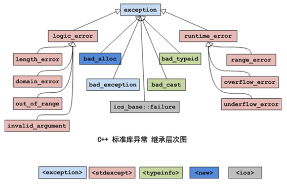

# Chapter 24 C++异常,断言

**C++98标准启用异常, 但是C++11标准启用**,但是如今部分项目仍然存在异常处理的代码

## 24.1 异常


### 	24.1.1 异常的语法

**1）捕获全部的异常**

```c++
  try
  {
    // 可能抛出异常的代码。
    // throw 异常对象;
  }
  catch (...)
  {
     // 不管什么异常，都在这里统一处理。
  }
```

**2）捕获指定的异常**

```c++
 try
  {
​    // 可能抛出异常的代码。
​    // throw 异常对象;
  }
  catch (exception1 e)
  { 
​    // 发生exception1异常时的处理代码。

  }
  catch (exception2 e)
  {

​    // 发生exception2异常时的处理代码。

  }
```

在try语句块中，如果没有发生异常，执行完try语句块中的代码后，将继续执行try语句块之后的代码；如果发生了异常，用throw抛出异常对象，异常对象的类型决定了应该匹配到哪个catch语句块，如果没有匹配到catch语句块，程序将调用abort()函数中止。

如果try语句块中用throw抛出异常对象，并且匹配到了catch语句块，执行完catch语句块中的代码后，将继续执行catch语句块之后的代码，不会回到try语 

**如果程序中的异常没有被捕获，程序将异常中止。**


### 	24.1.2 异常规范

C++98标准提出了异常规范，目的是为了让使用者知道函数可能会引发哪些异常。

```c++
void func1() throw(A, B, C);   // 表示该函数可能会抛出A、B、C类型的异常。

void func2() throw();      // 表示该函数不会抛出异常。

void func3();          // 该函数不符合C++98的异常规范。
```

C++11标准弃用了异常规范，使用新增的关键字`noexcept`指出函数不会引发异常。

```c++
void func4() noexcept;     // 该函数不会抛出异常。
```

在实际开发中，大部分程序员懒得在函数后面加`noexcept`，弃用异常已是共识，没必要多此一举。

关键字`noexcept`也可以用作运算符，判断表达试（操作数）是否可能引发异常；如果表达式**可能引发异常，则返回false**，否则返回true。


### 	24.1.3 C++标准库异常




### 	24.1.4 重点关注的异常

**1）std::bad_alloc**

> 如果内存不足，调用new会产生异常，导致程序中止；如果在new关键字后面加(std::nothrow)选项，则返回nullptr，不会产生异常。

示例：

```c++
\#include <iostream>

using namespace std;

int main()

{

   try {
       // 如果分配内存失败，会抛出异常。
       //double* ptr = new double[100000000000]; 
       // 如果分配内存失败，将返回nullptr，会抛出异常。
       double* ptr = new (std::nothrow) double[100000000000]; 
       if (ptr == nullptr) cout << "ptr is null.\n";
   }
   catch (bad_alloc& e)
   {
       cout << "catch bad_alloc.\n";
   }
}
```

**2）std::bad_cast**

> `dynamic_cast`可以用于引用，但是，C++没有与空指针对应的引用值，如果转换请求不正确，会出现`std::bad_cast`异常。

**3）std::bad_typeid**

> 假设有表达式`typeid(*ptr)`，当ptr是空指针时，如果ptr是多态的类型，将引发`std::bad_typeid`异常。


## 24.2 断言

断言（assertion）是一种常用的编程手段，用于排除程序中不应该出现的逻辑错误。

使用断言需要包含头文件`<cassert>`或`<assert.h>`，头文件中提供了带参数的宏assert，用于程序在运行时进行断言。

**语法：**

```C++
assert(表达式);
```

断言就是判断(表达式)的值，如果为0（false），程序将调用abort()函数中止，如果为非0（true），程序继续执行。

断言可以提高程序的可读性，帮助程序员定位违反了某些前提条件的错误。

**注意：**

> l 断言用于处理程序中不应该发生的错误，而非逻辑上可能会发生的错误。
>
> l 不要把需要执行的代码放到断言的表达式中。
>
> l 断言的代码一般放在函数/成员函数的第一行，表达式多为函数的形参。


```c++
void  copydata(void *ptr1,void *ptr2)   // 把ptr2中的数据复制到ptr1中。
{
    assert(ptr1&&ptr2);  // 断言ptr1和ptr2都不会为空。
    cout << "继续执行复制数据的代码......\n";
}
int main()
{
    int ii=0,jj=0;
    copydata(&ii, &jj);  // 把ptr2中的数据复制到ptr1中。
}
```


## 24.3 C++11静态断言

assert宏是运行时断言，在程序运行的时候才能起作用。

C++11新增了静态断言static_assert，用于在编译时检查源代码。

使用静态断言不需要包含头文件。

**语法：**

```c++
static_assert(常量表达式,提示信息);
```

**注意：**static_assert的第一个参数是**常量表达式**。而assert的表达式既可以是常量，也可以是变量。
