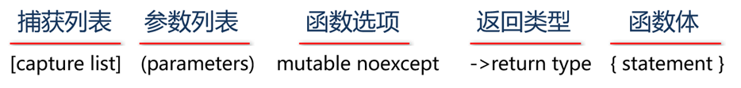
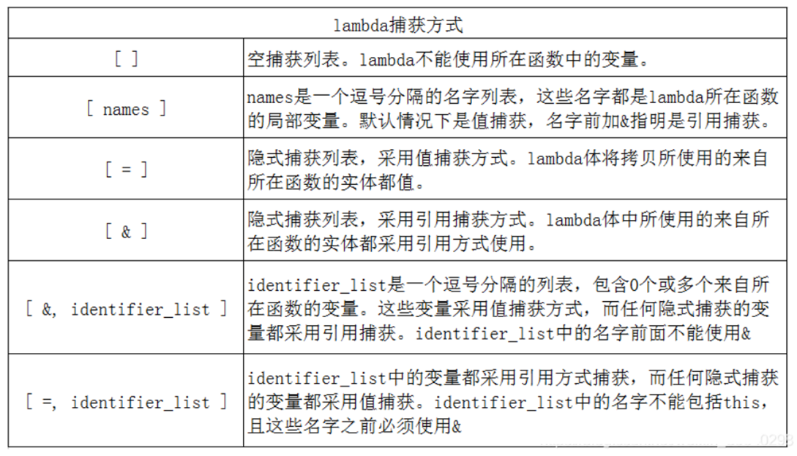
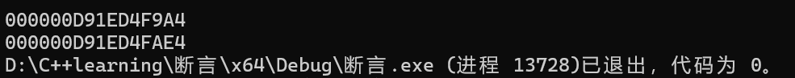

# Chapter 25 C++11标准


## 25.1 数据类型


### 	25.1.1long long类型

新增了类型long long和unsigned long long，以支持64位（或更宽）的整型。

**在VS中**，int和long都是4字节，long long是8字节。

**在Linux中**，int是4字节，long和long long是8字节。


## 25.2 统一初始化列表

C++11丰富了大括号的使用范围，用大括号括起来的列表（统一的初始化列表）可以用于所有内置类型和用户自定义类型。**使用统一的初始化列表时，可以添加等号（=），也可以不添加**：

```c++
class CGirl
{
public:
	std::string m_name;
	int m_age;
	CGirl( int age, std::string name) : m_name(name) , m_age(age)
	{}
	~CGirl()
	{return;}
};

int main()
{   int a = 10, b = 10;
	CGirl g2{ 18, "gwen" }; //C++98 标准
	CGirl g3 = { 18,"gwen" };//C++11 标准
	CGirl g1(18 ,"gwen");//C++11 标准
}
```

统一的初始化列表也可以用于**new表达式中**：

```C++
int *ar=new int[4]{2,4,6,7};
```


## 25.2 一些关键字


### 	25.2.1 final 关键字

**final关键字用于限制某个类不能被继承，或者某个虚函数不能被重写。**

**final关键字放在类名或虚函数名的后面。**

```c++
class BB : public AA
{
public:
    void test() final    // 如果有其它类继承BB，test()方法将不允许重写。
    {
        cout << "BB class...";
    }
};

class CC : public BB
{
public:
    void test()  // 错误，BB类中的test()后面有final，不允许重写。
    {
        cout << "CC class...";
    }
};
```


### 	25.2.2 override关键字

在派生类中，把override放在成员函数的后面，表示重写基类的虚函数，**提高代码的可读性。**

在派生类中，<font color=red>如果某成员函数不是重写基类的虚函数，随意的加上override关键字，编译器会报错</font>。

**示例:**

```c++
class AA 
{
public:
    virtual void test()
    {
        cout << "AA class...";
    }
};

class BB : public AA
{
public:
    void test() override
    {
        cout << "BB class...";
    }
};

```


### 	25.2.3  常量表达式constexpr关键字

const关键字从功能上来说有双重语义：只读变量和修饰常量。

C++11标准为了解决const关键字的双重语义问题，保留了const表示“只读”的语义，而将“常量”的语义划分给了新添加的constexpr关键字。

所以，C++11 标准中，建议将const和constexpr的功能区分开，表达“只读”语义的场景用const，**表达“常量”语义的场景用constexpr。**

```c++
void func(const int len1)
{
    // len1是只读变量，不是常量。
    int array1[len1]={0};        // VS会报错，Linux平台的数组长度支持变量，不会报错。

    const int len2 = 8;
    int array2[len2]={0};      // 正确，len2是常量。
}

```


### 	25.2.4 默认函数控制=default与=delete

在C++中自定义的类，编译器会默认生成一些成员函数：

> l 无参构造函数
>
> l 拷贝构造函数
>
> l 拷贝赋值函数
>
> l 移动构造函数
>
> l 移动赋值函数
>
> l 析构函数

**=default表示启用默认函数。**

**=delete表示禁用默认函数。**

```c++
class Girl
{
private:
    int m_bh = 20;                  // 年龄。
    string m_name = "美女";  // 姓名。
    char m_xb = 'X';               // 性别。
public:
    Girl() = default;                          // 启用默认构造函数。
    Girl(int bh, string name) : m_bh(bh), m_name(name) {}
    Girl(const Girl& g) = delete;      // 删除拷贝构造函数。
    void show() { cout << "bh=" << m_bh << ",m_name=" << m_name << endl; }
};

int main()
{
    Girl g1;
    g1.show();
    // Girl g2 = g1;            // 错误，拷贝构造函数已删除。
}
```


## 25.3 lambda 函数

lambda函数是C++11标准新增的语法糖，也称为lambda[表达式](https://so.csdn.net/so/search?q=表达式&spm=1001.2101.3001.7020)或匿名函数。

lambda函数的特点是：距离近、简洁、高效和功能强大。

**示例：**

```c++
auto f = [](const int& no) -> void { cout << "亲爱的" << no << "号：我是一只傻傻鸟。\n"; };
```

**语法：**

​                                  


```c++
#include <iostream>
#include <vector>
#include <algorithm>
using  namespace std;

int main()
{
	vector<int> vv = { 5,8,3 };   // 存放超女编号的容器。  
	// 第三个参数是lambda表达式。
	for_each(vv.begin(), vv.end(), 
		[](const int& no) {
			cout << "亲爱的" << no << "号：我是一只傻傻鸟。\n";
		}
	); //这里是括号
}
```


### 	25.3.1 lambda函数各项解析


#### 		25.3.1.1 参数列表

参数列表是可选的，类似普通函数的参数列表，**如果没有参数列表，()可以省略不写。**

与普通函数的不同：

> l lambda函数不能有默认参数。
>
> l 所有参数必须有参数名。
>
> l 不支持可变参数。


#### 		25.3.1.2返回类型

用后置的方法书写返回类型，类似于普通函数的返回类型，**如果不写返回类型，编译器会根据函数体中的代码推断出来。**

如果有返回类型，建议显式的指定，自动推断可能与预期不一致。


#### 		25.3.1.3捕获列表

通过捕获列表，lambda函数可以访问父作用域中的非静态局部变量（**静态局部变量可以直接访问，不能访问全局变量**）。

例如如下代码:

```c++
int globalval = 100;

int main(){
	int j = 0;
	auto f = [=]() -> void
		{
			globalval++;		
		};
	f();
	std::cout << globalval << endl;}
```

> 实际上全局变量不是由捕获列表按值传递进去, 在lambda函数内部更不是对其副本的操作, 而是**直接对全局变量本身地址进行操作**

捕获列表书写在[]中，与函数参数的传递类似，捕获方式可以是值和引用。

以下列出了不同的捕获列表的方式。



**1****）值捕获**

与传递参数类似，采用值捕获的前提是变量可以拷贝。

与传递参数不同，变量的值是在lambda函数创建时拷贝，而不是调用时拷贝。

例如：

```c++
   size_t v1 = 42;
   auto f = [ v1 ] { return v1; };  // 使用了值捕获，将v1拷贝到名为f的可调用对象。
   v1 = 0;
   auto j = f();  // j为42，f保存了我们创建它是v1的拷贝。
```

由于被捕获的值是在lambda函数创建时拷贝，因此在随后对其修改不会影响到lambda内部的值。

<font color =blue>**默认情况下，如果以传值方式捕获变量，则在lambda函数中不能修改变量的值,但是可以添加mutable 参数**</font>

**2）引用捕获**

和函数引用参数一样，引用变量的值在lambda函数体中改变时，将影响被引用的对象。

```c++
   size_t v1 = 42;
   auto f = [ &v1 ] { return v1; };  // 引用捕获，将v1拷贝到名为f的可调用对象。
   v1 = 0;
   auto j = f();   // j为0。
```


**3）隐式捕获**

除了显式列出我们希望使用的父作域的变量之外，还可以让编译器根据函数体中的代码来推断需要捕获哪些变量，这种方式称之为隐式捕获。

隐式捕获有两种方式，分别是[=]和[&]。[=]表示以值捕获的方式捕获外部变量，[&]表示以引用捕获的方式捕获外部变量。

```c++
  int a = 123;

  auto f = [ = ] { cout << a << endl; };    //值捕获
  f();    // 输出：123

  auto f1 = [ & ] { cout << a++ << endl; };    //引用捕获
  f1();   //输出：123（采用了后++）

  cout << a << endl;      //输出 124
```

**4）混合方式捕获**

lambda函数还支持混合方式捕获，即同时使用显式捕获和隐式捕获。

混合捕获时，捕获列表中的第一个元素必须是 = 或 &，此符号指定了默认捕获的方式是值捕获或引用捕获。

需要注意的是：显式捕获的变量必须使用和默认捕获不同的方式捕获。例如：

``` c++
   int i = 10;
   int j = 20;

   auto f1 = [ =, &i] () { return j + i; };    // 正确，默认值捕获，显式是引用捕获

   auto f2 = [ =, i] () { return i + j; };     // 编译出错，默认值捕获，显式值捕获，冲突了

   auto f3 = [ &, &i] () { return i +j; };    // 编译出错，默认引用捕获，显式引用捕获，冲突了
```

**5）修改值捕获变量的值**

在lambda函数中，如果以传值方式捕获变量，则函数体中不能修改该变量，否则会引发编译错误。

在lambda函数中，**如果希望修改值捕获变量的值，可以加mutable选项**，但是，**在lambda函数的外部**，变量的值不会被修改。

```c++
  int a = 123;
  auto f = [a]()mutable { cout << ++a << endl; }; // 不会报错

  cout << a << endl;   // 输出：123
  f();                // 输出：124
  cout << a << endl;   // 输出：123
```


## 25.4 右值引用


### 	25.4.1 左值、右值

在C++中，所有的值不是左值，就是右值。**左值是指表达式结束后依然存在的持久化对象，右值是指表达式结束后就不再存在的临时对象**。有名字的对象都是左值，右值没有名字。

还有一个可以区分左值和右值的便捷方法：**看能不能对表达式取地址，如果能，则为左值，否则为右值**。


> C++11扩展了右值的概念，将右值分为了纯右值和将亡值。
>
> l 纯右值：a）非引用返回的临时变量；b）运算表达式产生的结果；c）字面常量（C风格字符串除外，它是地址）。
>
> l 将亡值：与右值引用相关的表达式，例如：将要被移动的对象、T&&函数返回的值、std::move()的返回值、转换成T&&的类型的转换函数的返回值。
>
> (不懂纯右值和将亡值的区别其实没关系，统一看作右值即可，不影响使用。)

**示例：**

```c++
class AA {
  int m_a;
}; 

AA getTemp()
{
  return AA();
}

int ii = 3;    // ii是左值，3是右值。
int jj = ii+8;  // jj是左值，ii+8是右值。
AA aa = getTemp();  // aa是左值 ，getTemp()的返回值是右值（临时变量）。
```


`func()`的返回值本来在表达式语句结束后其生命也就该终结了（因为是临时变量），而通过右值引用重获了新生，其生命周期将与右值引用类型变量b的生命周期一样，只要b还活着，该右值临时变量将会一直存活下去。

```c++
int func()
{
	int a = 10;
	cout  << &a << endl;
	return a;
}

int main()
{
	int&& b = func();
	cout << &b<<endl;
}
```



右值引用`b`被赋予右值后, 就会成为左值, 可以取地址, 修改值 等操作, 

**但是注意:如下代码会报错<font color =red>, 右值只能引用右值!!!!!</font>**

```c++
int main()
{
    int temp =0;
	int&& b = func();
	int&& c = b;
    int&& d = temp ; //报错如上行一致
	cout << &b;
}
```

> 报错:  无法将右值引用绑定到左值	


### 	25.4.2 奇葩的 const 左值引用

但是，常量左值引用却是个奇葩**，它可以算是一个万能的引用类型，它可以绑定非常量左值、常量左值、右值**，而且在绑定右值的时候，常量左值引用还可以像右值引用一样将右值的生命期延长，**缺点是**，只能读不能改。

```c++
int a = 1;    

const int& ra = a;  // a是非常量左值。

const int b = 1; 
const int& rb = b; // b是常量左值。

const int& rc = 1;  // 1是右值。
```


## 25.5  移动语义

<font color =red size =4> **引入右值引用的主要目的是实现移动语义。**</font>

如果一个对象中有堆区资源，需要编写拷贝构造函数和赋值函数，实现深拷贝。

深拷贝把对象中的堆区资源复制了一份，如果源对象（被拷贝的对象）是临时对象，拷贝完就没什么用了，这样会造成没有意义的资源申请和释放操作。如果能够直接使用源对象拥有的资源，可以节省资源申请和释放的时间。C++11新增加的移动语义就能够做到这一点。

实现移动语义要增加两个函数：**移动构造函数和移动赋值函数。**

移动构造函数的语法：

```c++
类名(类名&& 源对象){......}
```

移动赋值函数的语法：

```c++
类名& operator=(类名&& 源对象){……}
```


注意：

1）对于一个左值，会调用拷贝构造函数，**但是有些左值是局部变量，生命周期也很短，能不能也移动而不是拷贝呢**？C++11为了解决这个问题，提供了std::move()方法来将左值转义为右值，从而方便使用移动语义。它其实就是告诉编译器，虽然我是一个左值，但不要对我用拷贝构造函数，用移动构造函数吧。左值对象被转移资源后，不会立刻析构，只有在离开自己的作用域的时候才会析构，<font color=red>**如果继续使用左值中的资源，可能会发生意想不到的错误**</font>。

```c++
AA a1;
AA a2 = std::move(a1); // 这将调用移动赋值函数
```

2）如果没有提供移动构造/赋值函数，只提供了拷贝构造/赋值函数，编译器找不到移动构造/赋值函数就去寻找拷贝构造/赋值函数。

3）C++11中的所有容器都实现了移动语义，避免对含有资源的对象发生无谓的拷贝。

4）移动语义对于拥有资源（如内存、文件句柄）的**对象有效**，如果是**基本类型**，使用移动语义没有意义。

```c++
class AA
{
public:
    int* m_data = nullptr;  // 数据成员，指向堆区资源的指针。

    AA() = default;             // 启用默认构造函数。

    void alloc() {                // 给数据成员m_data分配内存。
        m_data = new int;                       // 分配内存。
        memset(m_data, 0, sizeof(int));   // 初始化已分配的内存。
    }

    AA(const AA& a) {     // 拷贝构造函数。
        cout << "调用了拷贝构造函数。\n";            // 显示自己被调用的日志。
        if (m_data == nullptr) alloc();                     // 如果没有分配内存，就分配。
        memcpy(m_data, a.m_data, sizeof(int));     // 把数据从源对象中拷贝过来。
    }

    AA(AA&& a) {     // 移动构造函数。
        cout << "调用了移动构造函数。\n";            // 显示自己被调用的日志。
        if (m_data != nullptr) delete m_data;         // 如果已分配内存，先释放掉。
        m_data = a.m_data;                                   // 把资源从源对象中转移过来。
        a.m_data = nullptr;                                    // 把源对象中的指针置空。
    }

    AA& operator=(const AA& a) { // 赋值函数。
        cout << "调用了赋值函数。\n";                   // 显示自己被调用的日志。
        if (this == &a)   return *this;                      // 避免自我赋值。
        if (m_data == nullptr) alloc();                     // 如果没有分配内存，就分配。
        memcpy(m_data, a.m_data, sizeof(int));    // 把数据从源对象中拷贝过来。
        return *this;
    }

    AA& operator=(AA&& a) { // 移动赋值函数。
        cout << "调用了移动赋值函数。\n";            // 显示自己被调用的日志。
        if (this == &a)   return *this;                      // 避免自我赋值。
        if (m_data != nullptr) delete m_data;         // 如果已分配内存，先释放掉。
        m_data = a.m_data;                                   // 把资源从源对象中转移过来。
        a.m_data = nullptr;                                    // 把源对象中的指针置空。
        return *this;
    }

    ~AA() {                 // 析构函数。
        if (m_data != nullptr) {
            delete m_data; m_data = nullptr;
        }
    }
};

int main()
{
    AA a1;                  // 创建对象a1。
    a1.alloc();             // 分配堆区资源。
    *a1.m_data = 3;   // 给堆区内存赋值。
    cout << "a1.m_data=" << *a1.m_data << endl;

    AA a2 = a1;         // 将调用拷贝构造函数。
    cout << "a2.m_data=" << *a2.m_data << endl;

    AA a3;
    a3 = a1;              // 将调用赋值函数。
    cout << "a3.m_data=" << *a3.m_data << endl;

    auto f = [] { AA aa; aa.alloc(); *aa.m_data = 8; return aa; };   // 返回AA类对象的lambda函数。
    AA a4 = f();                // lambda函数返回临时对象，是右值，将调用移动构造函数。
    cout << "a4.m_data=" << *a4.m_data << endl;

    AA a6;
    a6 = f();              // lambda函数返回临时对象，是右值，将调用移动赋值函数。
    cout << "a6.m_data=" << *a6.m_data << endl;
}
```

**测试出现的问题:** 在a4的例子中没有调用移动构造函数

**原因:**

**编译器进行了一种被称为“命名返回值优化”（NRVO）的优化策略**，即使你的类 `A` 定义了移动赋值函数，这个优化会使它们不被调用。


## 26.6 完美转发

在函数模板中，可以将参数“完美”的转发给其它函数。**所谓完美，即不仅能准确的转发参数的值，还能保证被转发参数的左、右值属性不变。**

C++11标准引入了右值引用和移动语义，所以，能否实现完美转发，决定了该参数在传递过程使用的是拷贝语义还是移动语义。

为了支持完美转发，C++11提供了以下方案：

1）如果模板中（包括类模板和函数模板）函数的参数书写成为T&& 参数名，那么，函数既可以接受左值引用，又可以接受右值引用。

2）提供了模板函数`std::forward<T>(参数) `，用于转发参数，如果 参数是一个右值，转发之后仍是右值引用；如果参数是一个左值，转发之后仍是左值引用。

```c++
#include <iostream>
using namespace std;

void func1(int& ii) {        // 如果参数是左值，调用此函数。
    cout << "参数是左值=" << ii << endl;
}

void func1(int&& ii) {     // 如果参数是右值，调用此函数。
    cout << "参数是右值=" << ii << endl;
}

// 1）如果模板中（包括类模板和函数模板）函数的参数书写成为T&& 参数名，
// 那么，函数既可以接受左值引用，又可以接受右值引用。
// 2）提供了模板函数std::forward<T>(参数) ，用于转发参数，
// 如果参数是一个右值，转发之后仍是右值引用；如果 参数是一个左值，转发之后仍是左值引用。
template<typename TT>
void func(TT&& ii)
{
    func1(forward<TT>(ii));
}

int main()
{
    int ii = 3;
    func(ii);       // 实参是左值。
    func(8);       // 实参是右值。
}
```


## 26.7 可变参数模板

可变参数模版是C++11新增的最强大的特性之一，它对参数进行了泛化，能支持**任意个数**、任意数据类型的参数。

示例：

```c++
#include <iostream>
#include <thread>

using namespace std;

template <typename T>

void show(T girl)   // 向超女表白的函数，参数可能是超女编号，也可能是姓名，所以用T。
{
   cout << "亲爱的" << girl << "，我是一只傻傻鸟。\n";
}

// 递归终止时调用的非模板函数，函数名要与展开参数包的递归函数模板相同。
void print()
{
  cout << "递归终止。\n";
}

// 展开参数包的递归函数模板。
template <typename T, typename ...Args>
void print(T arg, Args... args)
{
   //cout << "参数： " << arg << endl;     // 显示本次展开的参数。 
   show(arg);    // 把参数用于表白。
   //cout << "还有" << sizeof...(args) << "个参数未展开。" << endl; // 显示未展开变参的个数。
   print(args...);   // 继续展开参数。
}

template <typename...Args>
void func(const string& str, Args...args)  // 除了可变参数，还可以有其它常规参数。
{
   cout << str << endl;  // 表白之前，喊句口号。
   print(args...);  // 展开可变参数包。 
   cout << "表白完成。\n";
}

int main(void)
{
   //print("金莲", 4, "西施");  
   //print("冰冰", 8, "西施", 3);
   func("我是绝世帅歌。", "冰冰", 8, "西施", 3); // "我是绝世帅歌。"不是可变参数，其它的都是。
}
```


## 26.8 时间操作的chrono库

C++11提供了chrono模版库，实现了一系列时间相关的操作（时间长度、系统时间和计时器）。

头文件：`#include <chrono>`

命名空间：`std::chrono`

​	

### 	26.8.1时间长度

duration模板类用于表示一段时间（时间长度、时钟周期），如：1小时、8分钟、5秒。

duration的定义如下:

```c++
template<class Rep, class Period = std::ratio<1, 1>>
class duration
{
  ……
};
```

为了方便使用，定义了一些常用的时间长度，比如：时、分、秒、毫秒、微秒、纳秒，它们都位于std::chrono命名空间下，定义如下：

```c++
using hours			= duration<Rep, std::ratio<3600>>	// 小时
using minutes			= duration<Rep, std::ratio<60>>		// 分钟
using seconds			= duration<Rep>						// 秒
using milliseconds		= duration<Rep, std::milli>			// 毫秒
using microseconds  	= duration<Rep, std::micro>  		// 微秒
using nanoseconds 	= duration<Rep, std::nano>  			// 纳秒
```

注意：

> l duration模板类重载了各种算术运算符，用于操作duration对象。
>
> l duration模板类提供了count()方法，获取duration对象的值。

示例:

```c++
    chrono::hours  t1(1);                                  // 1小时
    chrono::minutes  t2(60);                            //  60分钟
    chrono::seconds  t3(60 * 60);                    //  60*60秒
    chrono::milliseconds  t4(60 * 60 * 1000);  // 60*60*1000毫秒
    chrono::microseconds t5(60 * 60 * 1000 * 1000);          // 警告：整数溢出。
    chrono::nanoseconds t6(60 * 60 * 1000 * 1000*1000);  // 警告：整数溢出。
```


### 	26.8.2 系统时间

system_clock类支持了对系统时钟的访问，提供了三个静态成员函数：

```c++
// 返回当前时间的时间点。
static std::chrono::time_point<std::chrono::system_clock> now() noexcept;

// 将时间点time_point类型转换为std::time_t 类型。
static std::time_t to_time_t( const time_point& t ) noexcept;

// 将std::time_t类型转换为时间点time_point类型。
static std::chrono::system_clock::time_point from_time_t( std::time_t t ) noexcept;
```


```c++
int main()
{
    // 1）静态成员函数chrono::system_clock::now()用于获取系统时间。（C++时间）
   auto now = chrono::system_clock::now();

    // 2）静态成员函数chrono::system_clock::to_time_t()把系统时间转换为time_t。（UTC时间）
    auto t_now = chrono::system_clock::to_time_t(now);

    // t_now = t_now + 24*60*60;   // 把当前时间加1天。
    // t_now = t_now + -1*60*60;   // 把当前时间减1小时。
    // t_now = t_now + 120;           // 把当前时间加120秒。

    // 3）std::localtime()函数把time_t转换成本地时间。（北京时）
    // localtime()不是线程安全的，VS用localtime_s()代替，Linux用localtime_r()代替。
    auto tm_now = std::localtime(&t_now);

    // 4）格式化输出tm结构体中的成员。
    std::cout << std::put_time(tm_now, "%Y-%m-%d %H:%M:%S") << std::endl;
    std::cout << std::put_time(tm_now, "%Y-%m-%d") << std::endl;
    std::cout << std::put_time(tm_now, "%H:%M:%S") << std::endl;
    std::cout << std::put_time(tm_now, "%Y%m%d%H%M%S") << std::endl;

    stringstream ss;   // 创建stringstream对象ss，需要包含<sstream>头文件。
    ss << std::put_time(tm_now, "%Y-%m-%d %H:%M:%S");    // 把时间输出到对象ss中。
    string timestr = ss.str();     // 把ss转换成string的对象。
    cout << timestr << endl;
}
```


### 	26.8.3 计时器

steady_clock类相当于秒表，操作系统只要启动就会进行时间的累加，常用于耗时的统计（精确到纳秒）。

```c++
#include <iostream>
#include <chrono>
using namespace std;

int main()
{
    // 静态成员函数chrono::steady_clock::now()获取开始的时间点。
    auto start = chrono::steady_clock::now();

    // 执行一些代码，让它消耗一些时间。
    cout << "计时开始 ...... \n";
    for (int ii = 0; ii < 1000000; ii++) {
        // cout << "我是一只傻傻鸟。\n";
    }
    cout << "计时完成 ...... \n";

    // 静态成员函数chrono::steady_clock::now()获取结束的时间点。
    auto end = chrono::steady_clock::now();

    // 计算消耗的时间，单位是纳秒。
    auto dt = end - start;
    cout << "耗时: " << dt.count() << "纳秒（"<<(double)dt.count()/(1000*1000*1000)<<"秒）";
}
```

