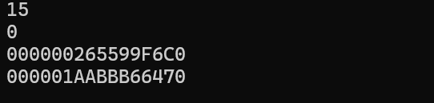

# Chapter29 STL容器


## 29.1 string 容器

一般情况需要引用头文件`#include<string>`但是VS2022 可以略去这一步骤


### 29.1 .1string 容器的构造

**1**  string容器会预先分配比字符串本身更大的空间以避免频繁的分配和释放内存。同时因此,当需要分配更大的空间时,string会先重新分配一块更大的空间并进行一次拷贝,将以前的空间释放掉 。所以说**在一次string赋值后,会出现两次显示字符串首地址不一样的情况**

```c++
	string s;
	cout << s.capacity() << endl;
	cout << s.size() << endl;
	cout << (void*)s.c_str() << endl;

	s = "dadsadadasdadadasddddddddddsssssss";
	cout << (void*)s.c_str() << endl;
```



**2**  几类构造函数的示例

- 1)`string (const string &s)`

  ```c++
  string s1(s2);
  //或者
  string s1 = s2;
  ```

  <font color = red >**下面这几种构造函数初学不常用 ,但是在文件处理和网络编程中特别常见**</font>

- 2)`string (size_t n, char c )   `创建由字符c组成的n个字符串的string容器

  ```c++
  string s2(10, 'x');
  ```


###   29.1.2 string 类的设计目标

- string类 即可以存放字符串
- 也可以做存放数据的容器

```c++
char s[8];
```

看到这一段代码你会想到什么?

可以存放7个字符的字符串

可以存放8个字符的数组

从本质上来看 ,这更是一个**内存为8个字节的一段空间** , 数据类型是编程语言的概念,指出来操作内存中数据的方法


相较于C风格字符串 string容器不存放空字符`'\0'` ,**因为string内部有3个指针:**

```c++
char* start; //内存空间起始地址
char* end ;  //内存空间结束地址
char* finish ; //已使用内存空间的末地址
```


### 29.1.3 string 类的成员函数(只举例几个重要的)

- #### 特性操作

  `size_t capacity() const; `  // 返回当前容量，可以存放字符的总数。

​       `size_t length() const; `  // 返回容器中数据的大小（字符串语义）。

​       ` size_t size() const;   `  // 返回容器中数据的大小（容器语义）。


- #### 交换操作

  `void swap(string &str); ` // 把当前容器与str交换。

  如果数据量很小，交换的是动态数组中的内容，如果数据量比较大，交换的是动态数组的地址。

- #### 截取操作

​		`string substr(size_t pos = 0,size_t n = npos) const; `// 返回pos开始的n个字节组成的子容器。


## 29.2 vector 容器

封装了动态数组 ,且支持任意类型的数组

包含头文件`#include<vector>`