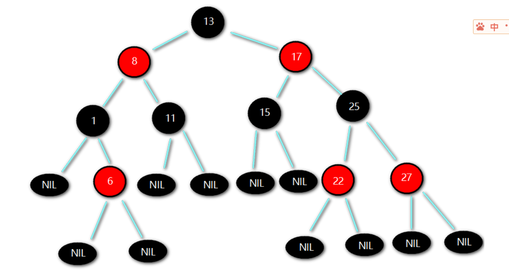
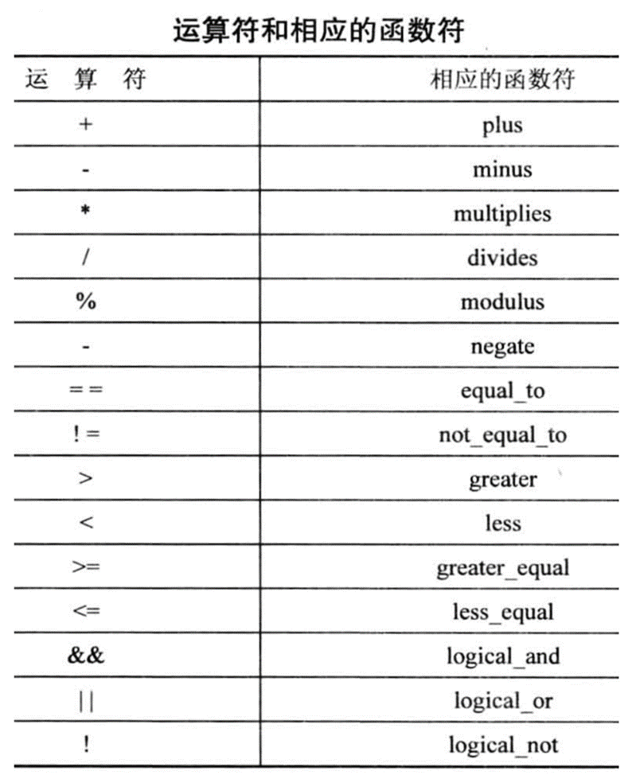
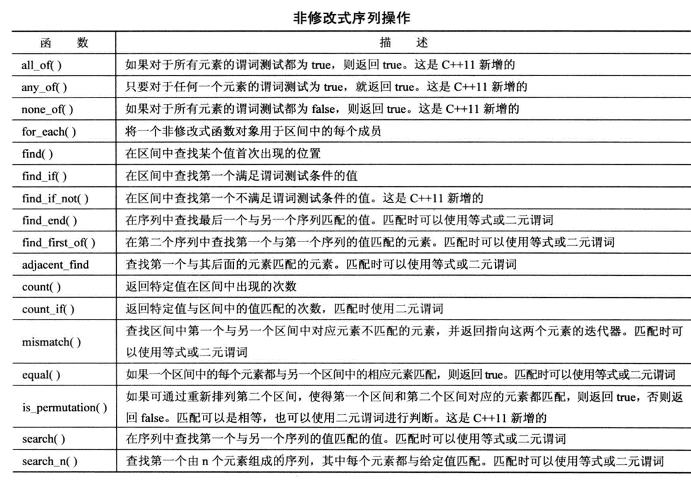
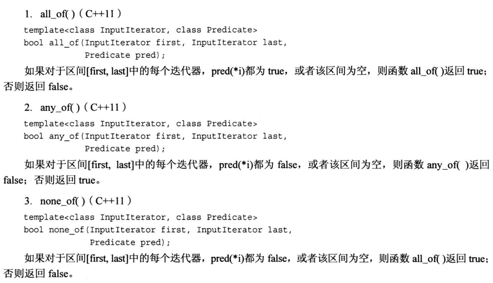
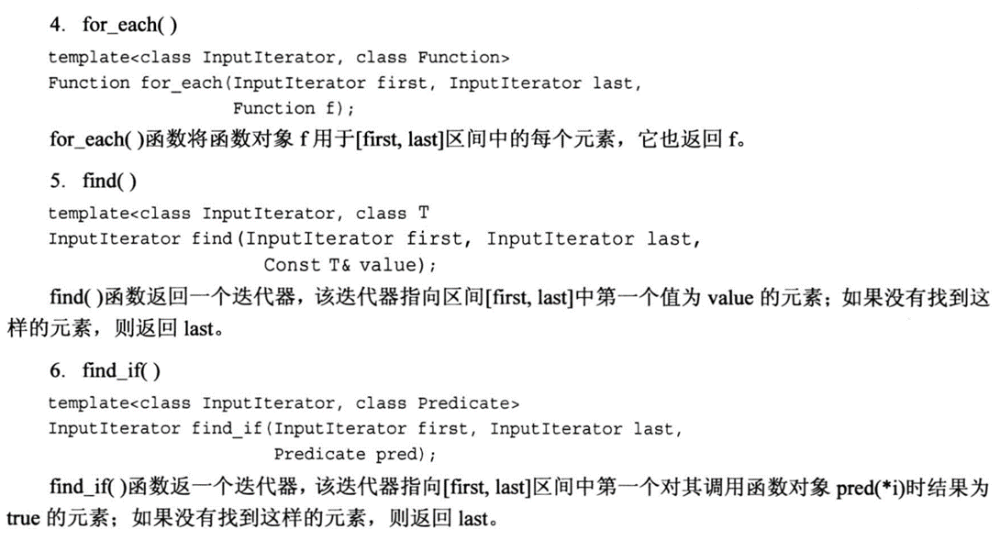

# Chapter29 STL容器


## 29.1 string 容器

一般情况需要引用头文件`#include<string>`但是VS2022 可以略去这一步骤


### 29.1 .1string 容器的构造

**1** string容器会预先分配比字符串本身更大的空间以避免频繁的分配和释放内存。同时因此,当需要分配更大的空间时,string会先重新分配一块更大的空间并进行一次拷贝,将以前的空间释放掉 。所以说**在一次string赋值后,会出现两次显示字符串首地址不一样的情况**

```c++
	string s;
	cout << s.capacity() << endl;
	cout << s.size() << endl;
	cout << (void*)s.c_str() << endl;

	s = "dadsadadasdadadasddddddddddsssssss";
	cout << (void*)s.c_str() << endl;
```


**2**  几类构造函数的示例

- 1)`string (const string &s)`

  ```c++
  string s1(s2);
  //或者
  string s1 = s2;
  ```

  <font color = red >**下面这几种构造函数初学不常用 ,但是在文件处理和网络编程中特别常见**</font>

- 2)`string (size_t n, char c )   `创建由字符c组成的n个字符串的string容器

  ```c++
  string s2(10, 'x');
  ```


###   29.1.2 string 类的设计目标

- string类 即可以存放字符串
- 也可以做存放数据的容器

```c++
char s[8];
```

看到这一段代码你会想到什么?

可以存放7个字符的字符串

可以存放8个字符的数组

从本质上来看 ,这更是一个**内存为8个字节的一段空间** , 数据类型是编程语言的概念,指出来操作内存中数据的方法


相较于C风格字符串 string容器不存放空字符`'\0'` ,**因为string内部有3个指针:**

```c++
char* start; //内存空间起始地址
char* end ;  //内存空间结束地址
char* finish ; //已使用内存空间的末地址
```

<font color = purple>**程序中尽量不要对含有string类的结构体或者对象进行`memset`因为 string类的对象中含有这三个指针 ,若进行清空 ,容易导致内存泄露**</font>


### 29.1.3 string 类的成员函数(只举例几个重要的)

- #### 特性操作

  `size_t capacity() const; `  // 返回当前容量，可以存放字符的总数。

​       `size_t length() const; `  // 返回容器中数据的大小（字符串语义）。

​       ` size_t size() const;   `  // 返回容器中数据的大小（容器语义）。


- #### 交换操作

  `void swap(string &str); ` // 把当前容器与str交换。

  如果数据量很小，交换的是动态数组中的内容，如果数据量比较大，交换的是动态数组的地址。

- #### 截取操作

​		`string substr(size_t pos = 0,size_t n = npos) const; `// 返回pos开始的n个字节组成的子容器。


## 29.2 vector 容器

封装了动态数组 ,且支持任意类型的数组

包含头文件`#include<vector>`

vector类模板的声明：

```c++
template<class T, class Alloc = allocator<T>>
class vector{
private:
	T *start_; 
	T *finish_;
	T *end_;
	……
}
```


### 	29.2.1 构造函数

```c++
1）vector();  // 创建一个空的vector容器。
2）vector(initializer_list<T> il); // 使用统一初始化列表。
3）vector(const vector<T>& v);  // 拷贝构造函数。
4）vector(Iterator first, Iterator last);  // 用迭代器创建vector容器。
5）vector(vector<T>&& v);  // 移动构造函数（C++11标准）。
```


### 	29.2.2 特性函数

```c++
size_t capacity() const;   // 返回容器的容量。

size_t size() const;     // 返回容器的实际大小（已使用的空间）。

bool empty() const;    // 判断容器是否为空。

void clear();        // 清空容器。

void reserve(size_t size);  // 将容器的容量设置为至少size。

void shrink_to_fit();     // 将容器的容量降到实际大小（需要重新分配内存）。

void resize(size_t size);  // 把容器的实际大小置为size。
```


### 	29.2.3 插入和删除

<font color =brown>尽量不要在vector容器中间插入或删除元素 因为这样搞得效率很低</font>

```c++
1）void push_back(const T& value);  // 在容器的尾部追加一个元素。
2）void emplace_back(…);           // 在容器的尾部追加一个元素，…用于构造元素。C++11
3）iterator insert(iterator pos, const T& value);  
// 在指定位置插入一个元素，返回指向插入元素的迭代器。

4）iterator emplace (iterator pos, …); 
// 在指定位置插入一个元素，…用于构造元素，返回指向插入元素的迭代器。C++11

5）iterator insert(iterator pos, iterator first, iterator last); 
// 在指定位置插入一个区间的元素，返回指向第一个插入元素的迭代器。

6）void pop_back();                      // 从容器尾部删除一个元素。
7）iterator erase(iterator pos);             // 删除指定位置的元素，返回下一个有效的迭代器。
8）iterator erase(iterator first, iterator last); // 删除指定区间的元素，返回下一个有效的迭代器。

```


示例(说明`emplace_back()`和`push_back`相比,可以**自动调用AA类的构造函数 并将元素后插**):

```c++
class AA
{
public:
	int m_num;
	int m_rank;
	AA() :m_num(0), m_rank(9999) {};
	AA(int num, int rank) :m_num(num), m_rank(rank){}

};

int main()
{
	vector<AA> v;
	cout << "v.capacity(): " << v.capacity() << endl;
	cout << "v.size(): " << v.size() << endl;  
	AA a1(1, 10);
	v.push_back(a1);
	v.emplace_back(2, 20);
	for (int i = 0; i < v.size(); i++)
	{
		cout << v[i].m_num << "  " << v[i].m_rank << endl;
	}
	
}
```


## 29.3 迭代器

无论是序列容器还是关联容器，最常做的操作无疑是遍历容器中存储的元素，而实现此操作，多数情况会选用“迭代器（iterator）”来实现。那么，迭代器到底是什么呢？

我们知道，尽管不同容器的内部结构各异，但它们本质上都是用来存储大量数据的，换句话说，都是一串能存储多个数据的存储单元。因此，诸如数据的排序、查找、求和等需要对数据进行遍历的操作方法应该是类似的。

既然类似，完全可以利用泛型技术，将它们设计成适用所有容器的通用算法，从而将容器和算法分离开。但实现此目的需要有一个类似中介的装置，它除了要具有对容器进行遍历读写数据的能力之外，还要能对外隐藏容器的内部差异，从而以统一的界面向算法传送数据。

这是泛型思维发展的必然结果，于是迭代器就产生了。简单来讲，迭代器和 [C++](https://blog.csdn.net/cplus/) 的 [指针](https://blog.csdn.net/c/80/)非常类似，它可以是需要的任意类型，通过迭代器可以指向容器中的某个元素，如果需要，还可以对该元素进行读/写操作。

### 迭代器类别

[STL](https://blog.csdn.net/stl/) 标准库为每一种标准容器定义了一种迭代器类型，这意味着，不同容器的迭代器也不同，其功能强弱也有所不同。

> 容器的迭代器的功能强弱，决定了该容器是否支持 STL 中的某种算法。

常用的迭代器按功能强弱分为 输入迭代器、 输出迭代器、 前向迭代器、 双向迭代器、 随机访问迭代器 5 种。本节主要介绍后面的这 3 种迭代器。

> 输入迭代器和输出迭代器比较特殊，它们不是把数组或容器当做操作对象，而是把输入流/输出流作为操作对象。有关这 2 个迭代器，我们会在后续章节做详细介绍。

1) 前向迭代器（forward iterator）

假设 p 是一个前向迭代器，则 p 支持 ++p，p++，*p 操作，还可以被复制或赋值，可以用 == 和 != 运算符进行比较。此外，两个正向迭代器可以互相赋值。

2) 双向迭代器（bidirectional iterator）

双向迭代器具有正向迭代器的全部功能，除此之外，假设 p 是一个双向迭代器，则还可以进行 --p 或者 p-- 操作（即一次向后移动一个位置）。

3) 随机访问迭代器（random access iterator）

随机访问迭代器具有双向迭代器的全部功能。除此之外，假设 p 是一个随机访问迭代器，i 是一个整型变量或常量，则 p 还支持以下操作：

- p+=i：使得 p 往后移动 i 个元素。
- p-=i：使得 p 往前移动 i 个元素。
- p+i：返回 p 后面第 i 个元素的迭代器。
- p-i：返回 p 前面第 i 个元素的迭代器。
- p[i]：返回 p 后面第 i 个元素的引用。

此外，两个随机访问迭代器 p1、p2 还可以用 <、>、<=、>= 运算符进行比较。另外，表达式 p2-p1 也是有定义的，其返回值表示 p2 所指向元素和 p1 所指向元素的序号之差（也可以说是 p2 和 p1 之间的元素个数减一）。

表 1 所示，是 C++ 11 标准中不同容器指定使用的迭代器类型。


| 容器                               | 对应的迭代器类型 |
| ---------------------------------- | ---------------- |
| array                              | 随机访问迭代器   |
| vector                             | 随机访问迭代器   |
| deque                              | 随机访问迭代器   |
| list                               | 双向迭代器       |
| set / multiset                     | 双向迭代器       |
| map / multimap                     | 双向迭代器       |
| forward_list                       | 前向迭代器       |
| unordered_map / unordered_multimap | 前向迭代器       |
| unordered_set / unordered_multiset | 前向迭代器       |
| stack                              | 不支持迭代器     |
| queue                              | 不支持迭代器     |

> 注意，容器适配器 stack 和 queue 没有迭代器，它们包含有一些成员函数，可以用来对元素进行访问。

### 迭代器的定义方式

尽管不同容器对应着不同类别的迭代器，但这些迭代器有着较为统一的定义方式，具体分为 4 种，如表 1 所示。


| 迭代器定义方式 | 具体格式                                   |
| -------------- | ------------------------------------------ |
| 正向迭代器     | 容器类名::iterator 迭代器名;               |
| 常量正向迭代器 | 容器类名::const_iterator 迭代器名;         |
| 反向迭代器     | 容器类名::reverse_iterator 迭代器名;       |
| 常量反向迭代器 | 容器类名::const_reverse_iterator 迭代器名; |

> 值得一提的是，表 2 中的反向迭代器全称为 "反向迭代器适配器"，后续章节会做详细讲解，这里读者只需要知道其用法即可。

通过定义以上几种迭代器，就可以读取它指向的元素， `*迭代器名`就表示迭代器指向的元素。其中，常量迭代器和非常量迭代器的分别在于，通过非常量迭代器还能修改其指向的元素。另外，反向迭代器和正向迭代器的区别在于：

- 对正向迭代器进行 ++ 操作时，迭代器会指向容器中的后一个元素；
- 而对反向迭代器进行 ++ 操作时，迭代器会指向容器中的前一个元素。

注意，以上 4 种定义迭代器的方式，并不是每个容器都适用。有一部分容器同时支持以上 4 种方式，比如 array、deque、vector；而有些容器只支持其中部分的定义方式，例如 forward_list 容器只支持定义正向迭代器，不支持定义反向迭代器。

> 具体容器支持定义迭代器的方式，讲具体容器时会详细说明。另外，读者也可以通过 [C++ STL标准手册](http://www.cplusplus.com/reference/stl/)，查询具体容器迭代器支持的定义方式。


```c++
   vector<int> v{1,2,3,4,5,6,7,8,9,10}; *//v被初始化成有10个元素*   
       
   cout << "第一种遍历方法：" << endl;    *//size返回元素个数*   
   for (int i = 0; i < v.size(); ++i)       
       cout << v[i] <<" "; *//像普通数组一样使用vector容器*   
       *//创建一个正向迭代器，当然，vector也支持其他 3 种定义迭代器的方式*          
   cout << endl << "第二种遍历方法：" << endl;    

vector<int>::iterator i;    *//用 != 比较两个迭代器*    
    for (i = v.begin(); i != v.end(); ++i)        
        cout << *i << " ";


```


## 29.4 基于范围的for循环

C++11中引入了基于范围的for循环。

语法：

```c++
for (迭代的变量 : 迭代的范围)
{
   // 循环体。
}
```

注意：

1）迭代的范围可以是数组名、容器名、初始化列表或者可迭代的对象（支持begin()、end()、++、==）。

2）数组名传入函数后，已退化成指针，不能作为容器名。

3）如果容器中的元素是结构体和类，迭代器变量应该申明为引用，加const约束表示只读。

4）注意迭代器失效的问题。


### 	29.4.1 迭代器失效

迭代器失效（Iterator Invalidation）是指当一个迭代器指向的容器被修改后，迭代器可能变得无效，无法再正确地访问容器中的元素。迭代器失效通常发生在容器进行结构性修改时，例如插入、删除、或重新分配元素。


#### 29.4.1.1 **容器扩展（Reallocation）**

- **原因**: 当向 `std::vector`、`std::deque` 等**动态数组容器中插入元素时，如果容器的容量已满，可能会触发内存重新分配（reallocation）。**容器会在内存中分配一块新的更大的内存区域，并将原有元素复制到新位置。

- **影响**: 重新分配会使所有指向旧内存区域的迭代器、指针、和引用失效，因为这些迭代器指向的是旧的内存区域，而数据已经移动到新位置。

- 示例:

  ```
  cpp复制代码std::vector<int> vec = {1, 2, 3};
  auto it = vec.begin();
  vec.push_back(4);  // 可能导致内存重新分配
  // it 现在是无效的
  ```

#### 29.4.1.2. **插入或删除元素**

- **`std::vector` 和 `std::deque`**:

  - **原因**: 插入或删除元素会改变容器的布局。对于 `std::vector`，在中间或前面插入或删除元素，会导致容器中的元素移动，从而使指向这些元素的迭代器失效。

  - **影响**: 在 `std::vector` 中，插入或删除元素后，所有指向插入位置之后的元素的迭代器都会失效。在 `std::deque` 中，插入或删除元素可能会使所有迭代器失效。

  - 示例:

    ```
    cpp复制代码std::vector<int> vec = {1, 2, 3};
    auto it = vec.begin() + 1; // it 指向 2
    vec.insert(it, 4);         // 在 it 位置插入 4，导致迭代器 it 失效
    ```

- **`std::list` 和 `std::forward_list`**:

  - **原因**: `std::list` 和 `std::forward_list` 是链表，插入或删除元素不会影响其他元素的存储位置。

  - **影响**: 对于 `std::list` 和 `std::forward_list`，插入或删除元素只会使与被删除或插入的节点相关的迭代器失效，其他迭代器不会失效。

  - 示例:

    ```
    cpp复制代码std::list<int> lst = {1, 2, 3};
    auto it = lst.begin();
    lst.insert(it, 0);  // it 依然有效
    lst.erase(it);      // it 失效，指向已删除的元素
    ```

#### 29.4.1.3. **容器清空**

- **原因**: 调用 `clear()` 清空容器时，容器中的所有元素都被销毁。

- **影响**: 所有指向容器元素的迭代器、指针、和引用都会失效。

- 示例:

  ```
  cpp复制代码std::vector<int> vec = {1, 2, 3};
  auto it = vec.begin();
  vec.clear();  // it 失效
  ```

#### 29.4.1.4. **容器的 `swap` 操作**

- **原因**: 容器的 `swap` 操作会交换两个容器的内部数据结构。

- **影响**: 如果容器被交换，所有指向容器的迭代器可能会失效，因为它们指向的元素位置在交换后不再有效。

- 示例:

  ```
  cpp复制代码std::vector<int> vec1 = {1, 2, 3};
  std::vector<int> vec2 = {4, 5, 6};
  auto it = vec1.begin();
  vec1.swap(vec2);  // it 现在指向 vec2 中的元素而不是 vec1
  ```

#### 29.4.1.5. **容器析构**

- **原因**: 当容器被销毁（例如超出作用域）时，所有与该容器相关的内存都会被释放。

- **影响**: 所有指向该容器元素的迭代器、指针、和引用都会失效。

- 示例:

  ```
  cpp复制代码std::vector<int>* vec = new std::vector<int>({1, 2, 3});
  auto it = vec->begin();
  delete vec;  // it 失效
  ```


## 29.5 list 容器

**list容器封装了双链表, 我们学过数据结构 , 实际上双链表和数组操作也大差不差**

包含头文件： `#include<list>`

list类模板的声明：

```c++
template<class T, class Alloc = allocator<T>>

class list{
private:
  iterator head;
  iterator tail;
  ……
}
```


### 29.5.1 构造函数

由于list为双链表结构 因此无需预先分配内存也无需 `capacity`函数

1）list(); // 创建一个空的list容器。

2）list(initializer_list<T> il); // 使用统一初始化列表。

3）list(const list<T>& l); // 拷贝构造函数。

4）list(Iterator first, Iterator last); // 用迭代器创建list容器。

5）list(list<T>&& l); // 移动构造函数（C++11标准）。


```c++
	// 4）list(Iterator first, Iterator last);  // 用迭代器创建list容器。
	list<int> l4(l3.begin(), l3.end());      // 用list容器的迭代器。
	for (int value : l4)  
		cout << value << " ";
	cout << endl;

	vector<int> v1 = { 1, 2, 3, 4, 5, 6, 7, 8, 9, 10 };  // 创建vector容器。
	list<int> l5(v1.begin() + 2, v1.end() - 3);          // 用vector容器的迭代器创建list容器。
	for (int value : l5)   
		cout << value << " ";
	cout << endl;

	int a1[] = { 1, 2, 3, 4, 5, 6, 7, 8, 9, 10 };   // 创建数组。
	list<int> l6(a1 + 2, a1 + 10 - 3);           // 用数组的指针作为迭代器创建list容器。
	for (int value : l6)     
		cout << value << " ";
	cout << endl;

```


### 	29.5.2 操作


###  	29.5.2.1 特性操作

```c++
size_t size() const;        // 返回容器的实际大小（已使用的空间）。

bool empty() const;      // 判断容器是否为空。

void clear();             // 清空容器。
```


### 	29.5.2.2 元素操作

```c++
T &front();        // 第一个元素。

const T &front();  // 第一个元素，只读。

const T &back();  // 最后一个元素，只读。

T &back();        // 最后一个元素。
```


### 	29.5.2.3 赋值操作

**给已存在的容器赋值，将覆盖容器中原有的内容。**

```c++
1）list &operator=(const list<T> &l);     // 把容器l赋值给当前容器。

2）list &operator=(initializer_list<T> il);  // 用统一初始化列表给当前容器赋值。

3）list assign(initializer_list<T> il);    // 使用统一初始化列表赋值。

4）list assign(Iterator first, Iterator last); // 用迭代器赋值。
```


### 	29.5.2.4 交换，反转，排序，归并

```c++
void swap(list<T> &l);   // 把当前容器与l交换，交换的是链表结点的地址。

void reverse();           // 反转链表。

void sort();              // 对容器中的元素进行升序排序。

void sort(_Pr2 _Pred);    // 对容器中的元素进行排序，排序的方法由_Pred决定（二元函数）。

void merge(list<T> &l);  // 采用归并法合并两个已排序的list容器，合并后的list容器仍是有序的。
```

疑问: 对于传入list容器 `l` 归并后,原容器`l`还存在吗?


### 	29.5.2.5 插入和删除

大体和vector差不多


## 29.6 pair键值对

pair是类模板，一般用于表示key/value数据，其实现是结构体。

**pair结构模板的定义如下：**

```c++
template <class T1, class T2>
struct pair 
{ 
    T1 first;     // 第一个成员，一般表示key。
    T2 second;  // 第二个成员，一般表示value。
	pair();       // 默认构造函数。
	pair(const T1 &val1,const T2 &val2);   // 有两个参数的构造函数。
	pair(const pair<T1,T2> &p);           // 拷贝构造函数。
	void swap(pair<T1,T2> &p);           // 交换两个pair。
};
```

**make_pair函数模板的定义如下：**

```c++
template <class T1, class T2>
make_pair(const T1 &first,const T2 &second)
{
	return pair<T1,T2>(first, second);
}
```


**示例(注意auto p4 和auto p5 内部具体实现过程):**

```c++
int main()
{
	pair<int, string> p0;
    cout << "p0 first=" << p0.first << ",second=" << p0.second << endl;

	pair<int, string> p1(1, "西施1");    // 两个参数的构造函数。
	cout << "p1 first=" << p1.first << ",second=" << p1.second << endl;

	pair<int, string> p2 = p1;             // 拷贝构造。
	cout << "p2 first=" << p2.first << ",second=" << p2.second << endl;

	pair<int, string> p3 = { 3, "西施3" };   // 两个参数的构造函数。
	 pair<int, string> p3 { 3, "西施3" };   // 两个参数的构造函数，省略了等于号。
	cout << "p3 first=" << p3.first << ",second=" << p3.second << endl;

	auto p4 = Pair<int, string>(4, "西施4");   // 匿名对象（显式调用构造函数）。
	cout << "p4 first=" << p4.first << ",second=" << p4.second << endl;

	auto p5 = make_Pair<int, string>(5, "西施5");   // make_pair()返回的临时对象。
	cout << "p5 first=" << p5.first << ",second=" << p5.second << endl;

	pair<int, string> p6 = make_pair(6, "西施6");  // 慎用，让make_pair()函数自动推导，再调用拷贝构造，再隐式转换。
	cout << "p6 first=" << p6.first << ",second=" << p6.second << endl;

	auto p7 = make_pair(7, "西施7");    // 慎用，让make_pair()函数自动推导，再调用拷贝构造。
	cout << "p7 first=" << p7.first << ",second=" << p7.second << endl;

	p5.swap(p4);   // 交换两个pair。

	cout << "p4 first=" << p4.first << ",second=" << p4.second << endl;
	cout << "p5 first=" << p5.first << ",second=" << p5.second << endl;

```


## 29.7 map容器


### 	29.7.1 红黑树

**红黑树（平衡二叉排序树）**

**黑树**（英语：Red–black tree）是一种[自平衡二叉查找树](https://zh.wikipedia.org/wiki/自平衡二叉查找树)，是在[计算机科学](https://zh.wikipedia.org/wiki/计算机科学)中用到的一种[数据结构](https://zh.wikipedia.org/wiki/数据结构)，典型用途是实现[关联数组](https://zh.wikipedia.org/wiki/关联数组)。它在1972年由[鲁道夫·贝尔](https://zh.wikipedia.org/wiki/鲁道夫·贝尔)发明，被称为“**对称二叉B树**”，它现代的名字源于[利奥尼达斯·J·吉巴斯](https://zh.wikipedia.org/wiki/利奧尼達斯·J·吉巴斯)和[罗伯特·塞奇威克](https://zh.wikipedia.org/wiki/罗伯特·塞奇威克)于1978年写的一篇论文。红黑树的结构复杂，但它的操作有着良好的最坏情况[运行时间](https://zh.wikipedia.org/wiki/算法分析)，并且在实践中高效：它可以在时间内完成查找、插入和删除，这里的n是树中元素的数目。




### 	29.7.2 定义与构造函数

包含头文件： #include<map>

map容器的元素是pair键值对。

map类模板的声明：

```c++
template <class K, class V,class P=less<K>, class _Alloc = allocator<pair<const K, V >>>
class map : public _Tree<_Tmap_traits< K, V, P, _Alloc, false>> 
{
   … 
}
/*
第一个模板参数K：key的数据类型（pair.first）。
第二个模板参数V：value的数据类型（pair.second）。
第三个模板参数P：排序方法，缺省按key升序。
第四个模板参数_Alloc：分配器，缺省用new和delete。
map提供了双向迭代器。
*/
```


```c++
1）map();  // 创建一个空的map容器。

2）map(initializer_list<pair<K,V>> il); // 使用统一初始化列表。

3）map(const map<K,V>& m);  // 拷贝构造函数。

4）map(Iterator first, Iterator last);  // 用迭代器创建map容器。

5）map(map<K,V>&& m);  // 移动构造函数（C++11标准）。
```


###  	29.7.3 插入和删除操作

```c++
1）void insert(initializer_list<pair<K,V>> il);  // 用统一初始化列表在容器中插入多个元素。

2）pair<iterator,bool> insert(const pair<K,V> &value);  // 在容器中插入一个元素，返回值pair：first是已插入元素的迭代器，second是插入结果。

3）void insert(iterator first,iterator last);  // 用迭代器插入一个区间的元素。

4）pair<iterator,bool> emplace (...);  // 将创建新键值对所需的数据作为参数直接传入，map容器将直接构造元素。返回值pair：first是已插入元素的迭代器，second是插入结果。
例：mm.emplace(piecewise_construct, forward_as_tuple(8), forward_as_tuple("冰冰", 18));
说明: 该示例将int作:key , CGirl类(年龄与姓名)作:value 此函数只调用了一次构造函数

5）iterator emplace_hint (const_iterator pos,...); // 功能与第4）个函数相同，第一个参数提示插入位置，该参数只有参考意义，如果提示的位置是正确的，对性能有提升，如果提示的位置不正确，性能反而略有下降，但是，插入是否成功与该参数元关。该参数常用end()和begin()。成功返回新插入元素的迭代器；如果元素已经存在，则插入失败，返回现有元素的迭代器。

6）size_t erase(const K & key);  // 从容器中删除指定key的元素，返回已删除元素的个数。

7）iterator erase(iterator pos);  // 用迭代器删除元素，返回下一个有效的迭代器。

8）iterator erase(iterator first,iterator last);  // 用迭代器删除一个区间的元素，返回下一个有效的迭代器。

```


**示例:**

```c++
#include <iostream>
#include <map>
using  namespace std;

class CGirl        // 超女类。
{
public:
	string m_name;   // 超女姓名。
	int      m_age;       // 超女年龄。

	/*CGirl() : m_age(0) {
		cout << "默认构造函数。\n";
	}*/
	CGirl(const string name, const int age) : m_name(name), m_age(age) {
		cout << "两个参数的构造函数。\n";
	}
	CGirl(const CGirl & g) : m_name(g.m_name), m_age(g.m_age) {
		cout << "拷贝构造函数。\n";
	}
};

int main()
{
	//map<int, CGirl> mm;
	//mm.insert     (pair<int, CGirl>(8, CGirl("冰冰", 18)));      // 一次构造函数，两次拷贝构造函数。
	//mm.insert     (make_pair<int, CGirl>(8, CGirl("冰冰", 18))); // 一次构造函数，两次拷贝构造函数。
	//mm.emplace(pair<int, CGirl>(8, CGirl("冰冰", 18)));          // 一次构造函数，两次拷贝构造函数。
	//mm.emplace(make_pair<int, CGirl>(8, CGirl("冰冰", 18)));     // 一次构造函数，两次拷贝构造函数。
	//mm.emplace(8, CGirl("冰冰", 18));                            // 一次构造函数，一次拷贝构造函数
	//mm.emplace(8, "冰", 18);                                    // 错误。
	//mm.emplace(piecewise_construct, forward_as_tuple(8), forward_as_tuple("冰冰", 18));  // 一次构造函数。

	//for (const auto& val : mm)
	//	cout << val.first << "," << val.second.m_name << "," << val.second.m_name << "  ";
	//cout << endl;

	//return 0;

	map<int, string> m;

	// 1）void insert(initializer_list<pair<K,V>> il);  // 用统一初始化列表在容器中插入多个元素。
	m.insert({ { 8,"冰冰" }, { 3,"西施" }});
	m.insert({ pair<int,string>(1,"幂幂"), make_pair<int,string>(7,"金莲"), {5,"西瓜"}});
	m.insert({ { 18,"冰冰" }, { 3,"西施" } });

	// 2）pair<iterator,bool> insert(const pair<K,V> &value);  
	// 在容器中插入一个元素，返回值pair：first是已插入元素的迭代器，second是插入结果。
	auto ret = m.insert(pair<int, string>(18, "花花"));
	if (ret.second == true) cout << "插入成功：" << ret.first->first << "," << ret.first->second << endl;
	else cout << "插入失败。\n";

	// 3）void insert(iterator first, iterator last);  // 用迭代器插入一个区间的元素。

	// 4）pair<iterator, bool> emplace(...);  
	// 将创建新键值对所需的数据作为参数直接传入，map容器将直接构造元素。
	// 返回值pair：first是已插入元素的迭代器，second是插入结果。
	auto ret1 = m.emplace(20, "花花");
	if (ret1.second == true) cout << "插入成功：" << ret1.first->first << "," << ret1.first->second << endl;
	else cout << "插入失败。\n";

	// 5）iterator emplace_hint(const_iterator pos, ...); 
	// 功能与第4）个函数相同，第一个参数提示插入位置，该参数只有参考意义，如果提示的位置是正确的，
	// 对性能有提升，如果提示的位置不正确，性能反而略有下降，但是，插入是否成功与该参数元关。
	// 该参数常用end()和begin()。成功返回新插入元素的迭代器；如果元素已经存在，则插入失败，返回现
	// 有元素的迭代器。
	m.emplace_hint(m.begin(), piecewise_construct, forward_as_tuple(23), forward_as_tuple("冰棒")); 

	for (auto& val : m)
		cout << val.first << "," << val.second << "  ";
	cout << endl;
}

```


## 29.7 unordered_map容器

<font size=4>**封装了散列(hash_table)**</font>

**由于该容器绝大部分操作与map无二,因此仅介绍部分特殊**


### 	29.7.1 定义与构造函数

包含头文件： #include<unordered_map>

unordered_map容器的元素是pair键值对。

unordered_map类模板的声明：

```c++
template <class K, class V, class _Hasher = hash<K>, class _Keyeq = equal_to<K>,
      class _Alloc = allocator<pair<const K, V>>>
class unordered_map : public _Hash<_Umap_traits<K, V, _Uhash_compare<K, _Hasher, _Keyeq>, _Alloc, false>>
{
   …
}
/*
第一个模板参数K：key的数据类型（pair.first）。
第二个模板参数V：value的数据类型（pair.second）。
第三个模板参数_Hasher：哈希函数，默认值为std::hash<K>
第四个模板参数_Keyeq：比较函数，用于判断两个key是否相等，默认值是std::equal_to<K>。
第五个模板参数_Alloc：分配器，缺省用new和delete。
*/
```


###   	29.7.2特性操作

```c++
1）size_t size() const;    // 返回容器中元素的个数。

2）bool empty() const;   // 判断容器是否为空。

3）void clear();       // 清空容器。

4）size_t max_bucket_count();   // 返回容器底层最多可以使用多少桶，无意义。

5）size_t bucket_count();     // 返回容器桶的数量，空容器有8个桶。

6）float load_factor();  // 返回容器当前的装填因子，load_factor() = size() / bucket_count()。

7）float max_load_factor();    // 返回容器的最大装填因子，达到该值后，容器将扩充，缺省为1。

8）void max_load_factor (float z ); // 设置容器的最大装填因子。

9）iterator begin(size_t n);    // 返回第n个桶中第一个元素的迭代器。

10）iterator end(size_t n);     // 返回第n个桶中最后一个元素尾后的迭代器。

11）void reserve(size_t n);     // 将容器设置为至少n个桶。

12）void rehash(size_t n);      // 将桶的数量调整为>=n。如果n大于当前容器的桶数，该方法会将容器重新哈希；如果n的值小于当前容器的桶数，该方法可能没有任何作用。

13）size_t bucket_size(size_t n);   // 返回第n个桶中元素的个数，0 <= n < bucket_count()。

14）size_t bucket(K &key);     // 返回值为key的元素对应的桶的编号。
```


### 	29.7.3 插入和删除

```c++
1）void insert(initializer_list<pair<K,V>> il); // 用统一初始化列表在容器中插入多个元素。

2）pair<iterator,bool> insert(const pair<K,V> &value); // 在容器中插入一个元素，返回值pair：first是已插入元素的迭代器，second是插入结果。

3）void insert(iterator first,iterator last); // 用迭代器插入一个区间的元素。

4）pair<iterator,bool> emplace (...); // 将创建新键值对所需的数据作为参数直接传入，map容器将直接构造元素。返回值pair：first是已插入元素的迭代器，second是插入结果。

*例：mm.emplace(piecewise_construct, forward_as_tuple(8), forward_as_tuple("冰冰", 18));*

5）iterator emplace_hint (const_iterator pos,...); // 功能与第4）个函数相同，第一个参数提示插入位置，该参数只有参考意义。对哈希容器来说，此函数意义不大。

6）size_t erase(const K & key); // 从容器中删除指定key的元素，返回已删除元素的个数。

7）iterator erase(iterator pos); // 用迭代器删除元素，返回下一个有效的迭代器。

8）iterator erase(iterator first,iterator last); // 用迭代器删除一个区间的元素，返回下一个有效的迭代器
```


### 	29.7.4示例(遍历操作,插入操作)

```c++
int main()
{
	unordered_map<int, string> m;
	cout << m.max_load_factor() << endl; //最大负载因子

	m.emplace(10, "gwen");
	m.emplace(11, "john");m.emplace(101, "nike");
    m.emplace(102, "adidas");m.emplace(103, "石破天");
	m.emplace(104, "ishowspeed");m.emplace(105, "alice");
    m.emplace(101, "jk");m.emplace(120,"jack");
	m.emplace(114, "ishowspeed"); m.emplace(175, "alice");
    m.emplace(101, "jk"); m.emplace(12054, "jack");
	cout << "current bucket_count=" << m.bucket_count() << endl;
    cout << "current element num=" << m.size()<< endl;
    
	cout << "current load_factor=" << m.load_factor() << endl;//打印负载因子大小 越小性能越高
	


	//遍历整个容器
	for (auto &iter : m)
	{
		cout << "num:" << iter.first << "  " << "name:" << iter.second << endl;
	}


	for (int ii = 0; ii < m.bucket_count() ;ii++)//遍历容器中所有的桶
	{
		cout << "bucket" << ii<<": ";
		for (auto iter2 = m.begin(ii); iter2!= m.end(ii); iter2++)//遍历桶中的元素
		{
			cout << "num: " << iter2->first << "name: " << iter2->second << " ";
		}
		cout << endl;
	}
}
```

#### 		29.7.4.1 为什么第一个遍历用需要引用 第二个遍历内层循环无需?

<font size =4>**第一个遍历需要引用**</font>

- 在这种情况下，我们不是在遍历桶，而是直接遍历 `std::unordered_map` 容器中的所有元素。
- `auto&` 用于引用每个元素，这样可以避免不必要的拷贝，提高性能，并且允许修改元素的值（如果需要）。

​     **总结：**

- 在遍历整个容器时，使用 `auto& iter : m` 是非常合适的，因为 `iter` 代表的是 `std::unordered_map` 中的每个元素的引用。
- 这和之后遍历桶的情况不同，在遍历桶时，迭代器 `iter2` 需要是一个迭代器对象，而不是引用。


<font size =4>**第二个遍历无需引用**</font>

1. **`auto iter2 = m.begin(ii);`**:
   - 这里 `auto` 推导出的类型是迭代器类型（例如 `std::unordered_map<int, std::string>::iterator`）。这个迭代器是一个对象，它可以被解引用来访问所指向的元素。
2. **`auto&` 用法**:
   - `auto&` 通常用于引用一个已经存在的对象。例如，如果我们希望引用 `std::unordered_map` 中某个元素，我们可以使用 `auto& element = *iter2;`，这里 `element` 是对迭代器 `iter2` 所指向元素的引用。
   - 如果将 `iter2` 声明为 `auto& iter2 = m.begin(ii);`，这会尝试创建对迭代器对象本身的引用，而不是对 `std::unordered_map` 中元素的引用。这种用法没有意义，因为 `iter2` 应该是一个迭代器对象，而不是对迭代器对象的引用。

**总结：**

- 使用 `auto` 声明 `iter2` 使其成为一个迭代器对象，允许我们遍历容器中的元素。
- 使用 `auto&` 的情况是当我们想要引用某个对象或容器中的元素，而不是迭代器本身。

在这种情况下，`iter2` 是用来遍历容器元素的迭代器，应该是一个对象，而不是引用，所以不能使用 `auto&`。


## 29.8 queue容器

queue容器的逻辑结构是队列，物理结构可以是数组或链表，主要用于多线程之间的数据共享。

包含头文件：` #include<queue>`

queue类模板的声明：

```c++
template <class T, class _Container = deque<T>>

class queue{
   ……
}

第一个模板参数T：元素的数据类型。
第二个模板参数_Container：底层容器的类型，缺省是std::deque，可以用std::list，还可以用自定义的类模板, 不可以用std::vector
```

<font color= purple>**queue容器不支持迭代器。**</font>


### 29.8.1 常用操作

```c++
1）void push(const T& value); // 元素入队。

2）void emplace(…);      // 元素入队，…用于构造元素。C++11

3）size_t size() const;     // 返回队列中元素的个数。

4）bool empty() const;    // 判断队列是否为空。

5）T &front();         // 返回队头元素。

6）const T &front();      // 返回队头元素，只读。

7）T &back();         // 返回队尾元素。

8）const T &back();      // 返回队头元素，只读。

9）void pop();        // 出队，删除队头的元素。
```


## 29.9STL算法


STL提供了很多处理容器的函数模板，它们的设计是相同的，有以下特点：

1）用迭代器表示需要处理数据的区间。

2）返回迭代器放置处理数据的结果（如果有结果）。

3）接受一个函数对象参数（结构体模板），用于处理数据（如果需要）。


###  	29.9.1函数对象

很多STL算法都使用函数对象，也叫函数符（functor），包括函数名、函数指针和仿函数。

函数符的概念：

1）生成器（generator）：不用参数就可以调用的函数符。

2）一元函数（unary function）：用一个参数可以调用的函数符。

3）二元函数（binary function）：用两个参数可以调用的函数符。

改进的概念：

1）一元谓词（predicate）：返回bool值的一元函数。

2）二元谓词（binary predicate）：返回bool值的二元函数。


### 	 29.9.2预定义的函数对象

STL定义了多个基本的函数符，用于支持STL的算法函数。

包含头文件：#include <functional>

​                               

### 	 29.9.3算法函数

STL将算法函数分成四组：

1）非修改式序列操作：对区间中的每个元素进行操作，这些操作不修改容器的内容。

2）修改式序列操作：对区间中的每个元素进行操作，这些操作可以容器的内容（可以修改值，也可以修改排列顺序）。

3）排序和相关操作：包括多个排序函数和其它各种函数，如集合操作。

4）通用数字运算：包括将区间的内容累积、计算两个容器的内部乘积、计算小计、计算相邻对象差的函数。通常，这些都是数组的操作特性，因此vector是最有可能使用这些操作的容器。

前三组在头文件#include <algorithm>中，第四组专用于数值数据，在#include <numeric>中。

详见《C++ Primer plus》，第六版，从886页开始。









### 	29.9.4学习要领

**1）如果容器有成员函数，则使用成员函数，如果没有才考虑用STL的算法函数。**

例如: `sawp`函数: vector 容器中有`swap`的成员函数 ,直接交换动态分配的内存效率更高

<font color =red>STL库的`sort`,排序的算法函数很多是为vector容器准备的</font>

2）把全部的STL算法函数过一遍，知道大概有些什么东西。

**3）如果打算采用某算法函数，一定要搞清楚它的原理，关注它的效率。**

4）不要太看重这些算法函数，自己写一个也就那么回事。

5）不是因为简单，而是因为不常用。
