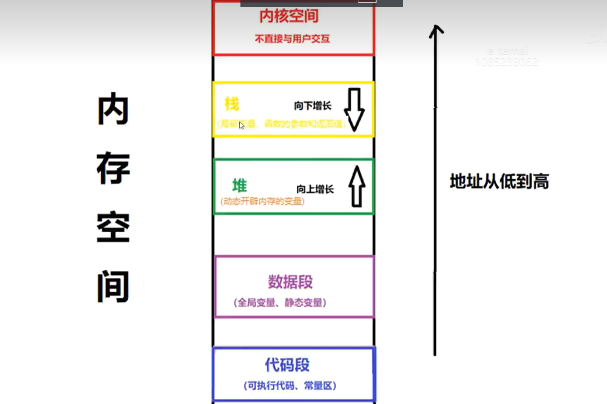

# Chapter9.内存模型和指针

---


##  9.1 内存模型

###      9.1.1 内核空间：

 操作系统管理，不直接与用户进行交互

###      9.1.2 用户空间：

- **代码段**:当函数编译后,存放程序代码和常量的地方
- **数据段**:存放静态变量和全局变量
- **堆**:存放动态开辟内存的变量
- **栈**:存放函数的返回值,函数的参数 和局部变量



###    9.1.3 栈和堆的主要区别

**1）管理方式不同：栈是系统自动管理的，在出作用域时，将自动被释放；堆需手动释放，若程序中不释放，程序结束时由操作系统回收。**

**2）空间大小不同：堆内存的大小受限于物理内存空间；而栈就小得可怜，一般只有8M（可以修改系统参数)。**

3）分配方式不同：堆是动态分配；栈有静态分配和动态分配（都是自动释放）。

4）分配效率不同：栈是系统提供的数据结构，计算机在底层提供了对栈的支持，进栈和出栈有专门的指令，效率比较高；堆是由C++函数库提供的。

5）是否产生碎片：对于栈来说，进栈和出栈都有着严格的顺序（先进后出），不会产生碎片；而堆频繁的分配和释放，会造成内存空间的不连续，容易产生碎片，太多的碎片会导致性能的下降。


## 9.2 new 和delete

使用堆区的内存有四个步骤：

1）声明一个指针；

2）用new运算符向系统申请一块内存，让指针指向这块内存；

3）通过对指针解引用的方法，像使用变量一样使用这块内存；

4）如果这块内存不用了，用delete运算符释放它。

申请内存的语法：new 数据类型(初始值);  // C++11支持{}

如果申请成功，返回一个地址；如果申请失败，返回一个空地址（暂时不考虑失败的情况）。

```c++
int *x ;
x = new int(4);
cout<< x <<endl; 
//输出 ‘4’
```

注意：

-  动态分配出来的内存没有变量名，只能通过指向它的指针来操作内存中的数据。

-  **如果动态分配的内存不用了，必须用delete释放它，否则有可能用尽系统的内存。**

- 动态分配的内存生命周期与程序相同，程序退出时，如果没有释放，系统将自动回收。

- l就算指针的作用域已失效，所指向的内存也不会释放。

-  用指针跟踪已分配的内存时，不能跟丢。


##   9.3 二级指针

**指针**是**指针变量**的简称，也是**变量**，是**变量**就有**地址**， **指针本身也有地址**

**指针**用于存放**普通变量**的**地址**。（指针变量的值是堆空间某一块内存地址）

**二级指针**用于存放**指针变量**的**地址**。

在函数中，如果传递普通变量的地址，形参用指针；**传递指针的地址，形参用二级指针。**(一定要记住好不好!)

把普通变量的地址传入函数后可以在函数中修改变量的值；**把指针的地址传入函数后可以在函数中指针的值。**


示例1:

```c++
int * p =0;
{
    int *pp = &p;
    //报错: 无法将int** 传递给 int*
}
```

示例2:

```c++
int * p =0;
{
    int*pp = p;
    pp = new int(3);
}
//代码块执行完 无法对指针p的值进行修改 

```

示例3:

```c++
int * p =0;
{
    int** pp = &p;
    *pp = new int(3);
}
//此为范例 ,运行完代码块后 指针p指向新的内存地址 ,且地址指向的值赋为3
```


## 9.4 空指针

- **在函数中，应该有判断形参是否为空指针的代码，目的是保证程序的健壮性。**

  ```c++
  void func(int *p1 ,int* p2)
  {
      if(p1==0 ||p2 == 0) return ;
      //养成良好习惯!!!
      .........
  }
  ```

  

###   9.4.1为什么出现空指针访问会异常??

NULL指针分配的分区：其范围是从 0x00000000到0x0000FFFF。这段空间是空闲的，对于空闲的空间而言，没有相应的物理存储器与之相对应，所以对这段空间来说，任何读写操作都是会引起异常的。空指针是程序无论在何时都没有物理存储器与之对应的地址。为了保障“无论何时”这个条件，需要人为划分一个空指针的区域，固有上面NULL指针分区。


###    9.4.2 C++11 的nullptr

用0和NULL表示空指针会产生歧义，C++11建议用nullptr表示空指针，也就是(void *)0。
NULL在C++中就是0，这是因为在C++中void* 类型是不允许隐式转换成其他类型的，所以之前C++中用0来代表空指针，但是在重载整形的情况下，会出现上述的问题。所以，C++11加入了nullptr，可以保证在任何情况下都代表空指针，而不会出现上述的情况，因此，建议用nullptr替代NULL吧，而NULL就当做0使用。
注意：在Linux平台下，如果使用nullptr，编译需要加-std=c++11参数。


##  9.5  函数指针与回调函数

###   9.5.1 函数指针的基本用法

- 声明:

  ```c++
  int (*fp1)(ina ,int b);
  void(*fp2)();
  string(*fp3)(int c ,int d);
  ```

- 赋值

  ```c++
  fp1 = func1;
  fp2 = func2;
  ......
  ```

- 使用

  ```c++
  //c++风格
  fp1(num1 ,num2);
  fp2();
  fp3(num3,num4);
  
  //c语言风格
  (*fp1)(num1 ,num2);
  (*fp2)();
  ....
  ```

- **应用场景:**

**函数指针多用在网络通信以及多线程编程之中**


###    9.5.2回调函数

调用者函数提供主体的流程和框架,具体实现依靠回调函数

```c++
int muliplication(int& a , int& b)
{
	a *= b;
	return a;
}

int func(int(*fp)(int&, int&),int &a ,int& b ) //调用者函数
{
    return 	fp(a, b);//回调函数

}
int main()
{
	int a = 10;
	int b = 100;
	cout << "a=" << a << endl;
	func(add, a, b);
	cout << "a2=" << a << endl;
	return 0;
}
```

